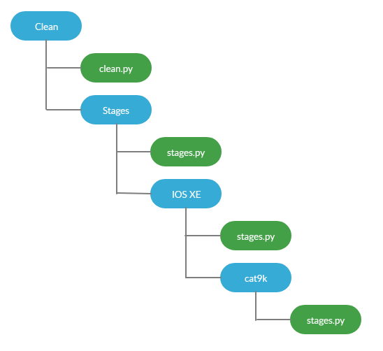

Design
======

`pyATS Clean` is highly modular. Within the clean datafile, the clean stage to
execute are provided and each are executed in the order given.

This give the flexibility to run the clean in any order, repeat some section,
add your own section, etc. It is not a script, but a pool of available clean
stage you can shape in any clean you wish.

Clean yaml
----------

Before jumping in, we need to understand the parts of the
clean yaml - what they do and how they work! The following
example is a bare minimum requirement and you can add any
stages you desire.

.. code-block:: yaml

    # The 'cleaners' block defines what cleaner to use
    # and where to find it.
    cleaners:

      # The cleaner we are using is 'DeviceClean'. This is
      # a python class that inherits from the Kleenex base
      # cleaner. It is responsible for loading the testbed,
      # devices, and starting the clean testcase.
      DeviceClean:

        # The 'module' key points to the where the cleaner can
        # be located which in this case is the 'genie.libs.clean'
        # package.
        module: genie.libs.clean

        # The 'devices' key is used to specify what devices to clean.
        devices: [router1, router2]

    # The 'devices' block defines all the devices, the stages to use,
    # and which order they run in.
    devices:

      # This block is specific to the device 'router1'.
      # Each device can have its own combination and order
      # of stages. Must match the one in the testbed file
      router1:

        # This is where the stages are defined. Stages are simply
        # python functions that do a specific action. The name of
        # the stage is the name of the python function. So in this
        # stage 'copy_to_device' is referring to a python function
        # called 'copy_to_device'. There can be unlimited stages.
        copy_to_device:

          # Under the stage is where we can pass arguments to the
          # python function.
          <stage_argument>: <value>

        # The order key is a list in which defines the order the
        # stages will be run in.
        order:
          - copy_to_device

.. info::

  Make sure you read the comments above! After this all will make sense!

Clean Stages
------------

Clean Stages are the building blocks to `pyATS Clean`. Each stage has a specific job
that is OS agnostic. Each stage can be customized at an abstracted level
based on OS and platform requirements:

A few of the stages we have are:

* | **connect**
  | Connects to the device

* | **apply_configuration**
  | Applies a given configuration to the device

* | **verify_running_image**
  | Verifies that the running image is the correct image

* | **copy_to_device**
  | Copies an image to the device

.. note::

    This is not a complete list. View all the available stages
    `here. <https://pubhub.devnetcloud.com/media/genie-feature-browser/docs/#/clean>`_

Each of these steps can be run in any order to create a clean. To run the same
stage multiple time, you can add a `__<number>` at the end of it.

Device Recovery
---------------

The `Device Recovery` feature is the jack of all trades when it comes to
recovering devices that cannot be connected to or are stuck in rommon mode.

#. If the device cannot be connected to, `Device Recovery` will
   attempt to clear the lines.
#. If the device still cannot be connected to after clearing the
   lines, `Device Recovery` will attempt to power cycle the device(s)
#. If the device is in rommon mode, `Device Recovery` will install a
   known good image and configuration so the device can boot with an image on
   the device or with netboot (tftpboot).

The clear line and the powercycler information need to be added to the testbed
file under `peripherals`. Below is a full example within a testbed file.

.. code-block:: yaml

  devices:
    PE1:
      alias: uut
      connections:
        a:
          ip: 172.27.101.123
          port: 2047
          protocol: telnet
        b:
          ip: 172.27.101.123
          port: 2048
          protocol: telnet
      credentials:
        default:
          username: admin
          password: CSCO12345^
        enable:
          password: admin
      os: nxos
      type: nxos
      peripherals:
        terminal_server:
          # Provide the terminal server name (It must be within the testbed
          # file)

          # Port to clear if they are busy
          ssr-ts-dbest: [47, 48]
        power_cycler:
          type: raritan-px2
          connection_type: snmp
          host: '172.27.101.209'
          read_community: public
          write_community: public
          outlets: [19, 20]
  
    ssr-ts-dbest:
      connections:
        a:
          ip: 172.27.101.123
          protocol: telnet
      credentials:
        default:
          password: lab
        enable:
          password: lab
      os: ios
      type: ios

Supported Platforms
-------------------

List of available OS and platform supported

.. csv-table::
   :header: "OS", "Platform"
   :widths: 10, 10

   iosxe, asr1k
   iosxe, csr1000v
   iosxe, isr
   iosxe, cat9k
   nxos, n7k
   nxos, n9k
   nxos, n9kv
   IOSXR, 

Supported PowerCyclers
----------------------

List of available supported powercycler

 * raritan-px
 * raritan-px2
 * apc
 * apc-rpdu
 * dualcomm
