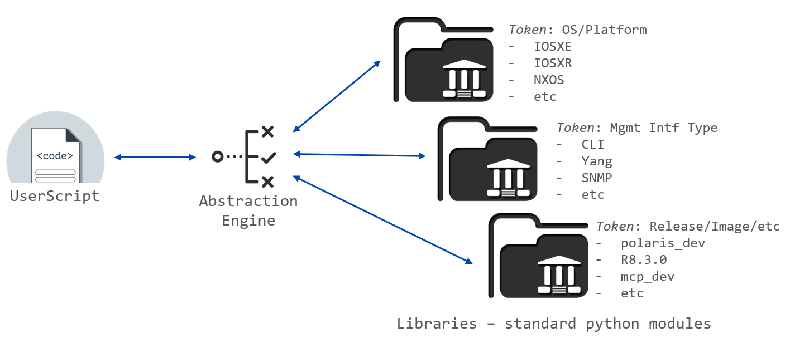

Introduction
============

In software engineering and computer science, **abstraction** is a technique for
managing complexity of computer systems. It works by establishing a level of
complexity on which a person interacts with the system, suppressing the more
complex details below the current level. The programmer works with an 
idealized interface (usually well defined) and can add additional levels of 
functionality that would otherwise be too complex to handle. (:wikipedia:`Wikipedia <http>`)

As Python is a :dynamicallytyped:`dynamically typed <http>`,
:objectoriented:`object-oriented <http>` programming language, function/code
and data abstraction can be achieved easily through 
:ducktyping:`duck typing <http>` and :inheritance:`inheritance <http>`:
defining classes/objects that behaves similarly in a given context, and hiding
details of implementation under its methods and properties.
    
    *If it flies like a duck & quacks like a duck, it's a duck!*

.. code-block:: python

    # Example
    # -------
    #
    #   duck typing and inheritance

    class Mallard(object):
        def quack(self):
            raise NotImplementedError

        def fly(self):
            raise NotImplementedError

    class Duck(Mallard):
        def quack(self):
            print("Quack, quack!");

        def fly(self):
            print("Flap, Flap!");

    class Person(Mallard):
        def quack(self):
            print("I'm Quackin'!");

        def fly(self):
            print("I'm Flyin'!");

    for mallard in [Duck(), Person()]:
        mallard.fly()
        mallard.quack()

The above stipulates how classes can be defined to behave similarly (eg, through
similar interfaces and subclassing). However, it doesn't solve how the system 
should pick the *correct class* during runtime. Often times, additional logic is
required to sort out which appropriate class should be used, based on given 
information.

.. code-block:: python

    # Example
    # -------
    #
    #   try and pick the class by breed

    if breed == "human":
        cls = Person
    else:
        cls = Duck

    mallard = cls()

    # ... etc

Eventually, this logic leads us to factory methods.

.. code-block:: python

    # Example
    # -------
    #
    #   factory method creating various shapes

    class Shape(object):
        types = []

    class Circle(Shape):
        def draw(self): print("Circle.draw")
        def erase(self): print("Circle.erase")

    class Square(Shape):
        def draw(self): print("Square.draw")
        def erase(self): print("Square.erase")

    def factory(type):
        '''I'm the factory method!'''

        if type == "Circle": return Circle()
        if type == "Square": return Square()
        raise ValueError("Bad shape creation: " + type)

Factory Method
    a creational pattern that uses factory methods to deal with the problem 
    of creating objects without having to specify the exact class of the 
    object that will be created.

:FactoryMethods:`Factory Methods <http>` allowers users to create classes using "requirements" as 
inputs, returning the corresponding class objects. The main challenge with this 
approach is **its dependency on the creator**: factory methods are only as 
powerful as its creator's coding. Adding support for more requirements and/or
classes requires modification to the original code. Further, as each person may 
choose to implement their own set of logic and requirements... the similarity,
traceability and debuggability of factory methods across the board may be poor.

Our Solution
------------

The ``abstract`` package is intended solve the above issue by **standardizing the 
abstraction decision making process**. Through the use of abstraction tokens & 
lookup algorithms, the package empowers users to write agnostic libraries and 
scripts capable of handling a variety of differences between 
os/platform/feature/release/mgmt interface, etc.

    Abstraction Concept

.. code-block:: python

    # Example
    # -------
    #
    #   with and without abstraction

    # typical non-abstracted script
    # -----------------------------
    # import the proper function through if statements
    if release == 'v2.1':
        if context == 'YANG':
            from my_library.v2_1.yang import configure_something
        else:
            from my_library.v2_1.cli import configure_something
    elif release == 'v2.2':
        if context == 'YANG':
            from my_library.v2_2.yang import configure_something
        else:
            from my_library.v2_2.cli import configure_something
    else:
        if context == 'YANG':
            from my_library.generic import configure_something
        else:
            from my_library.generic import configure_something

    # get result
    result = configure_something()

    # using abstraction & properly abstracted libraries
    # -------------------------------------------------
    from genie import abstract

    # build a lookup object and pass the release/context as tokens
    lookup = abstract.Lookup(release, context)

    # collect result by looking up the corresponding API
    result = lookup.my_library.configure_something()

As show above, through the use of ``abstract`` package, users can write
straightforward codes (single-source) that automatically invokes the right set
of library APIs (classes, functions, methods etc) based on given requirements,
without the repeated use of custom ``if..elif..elif..else`` statements 
everywhere. This dynamic library referencing can be beneficial in many use
cases, including but not limited to:

    - handling minute release-to-release, image-to-image differences 
    - running the same tests/scripts across different management interfaces: 
      CLI, YANG, XML
    - running the same tests/scripts across a variety of hardware (controllers, 
      linecards, interfaces, os/platforms, etc)

Support
-------

Reach out to :mailto:`contact us <cisco.com>` for any questions or issues related to the
``genie.abstract`` package.

You can also post questions to the :communityforum:`community forum <http>` - the support team patrols
these forums daily.
