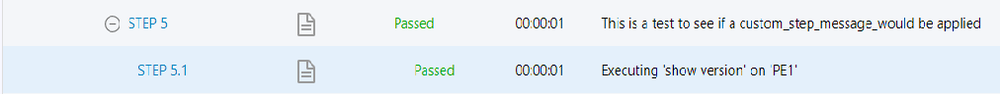
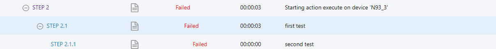

Customizing steps log messages
=================================

In blitz all the steps message are fully customizable. This allows test engineers to not only develop their testscript but also,
be able to make the output more clear for themselves. Three different keywords can be used within the body of the action that could
customize each step message.

**Example-1: Customizing starting step message**

By specifying keyword ``custom_start_step_message`` as part of the action the starting step message 
will be customized.

.. code-block:: YAML

    - execute:
        command: show version
        device: PE1
        custom_start_step_message: My own message instead of the default one
        timeout: 100

as shown in the image you can see how in the logs the starting message is customized.

**Example-2: Customizing substeps**

By specifying keyword ``custom_substep_message`` as well as ``custom_verification_message``
the substeps would be customized as well. ``custom_verification_message`` will be only useful
if verification on action outputs are being done (using include/exclude)

.. code-block:: YAML

            - execute:
                custom_substep_message: first test
                custom_verification_message: second test
                command: show version
                device: N93_3
                include: 
                  - "\d"
as shown in the image you can see how in the logs the starting message is customized.

**Example-3: Customizing substeps of a loop advanced action**

.. code-block:: YAML

    - loop:
        loop_variable_name: name1
        range: 12
        custom_substep_message: Applying custom_substep_message to substeps of a loop
        actions:
                - execute:
                    custom_verification_message: second test
                    command: show version
                    device: N93_3
                    include: 
                      - "\d"