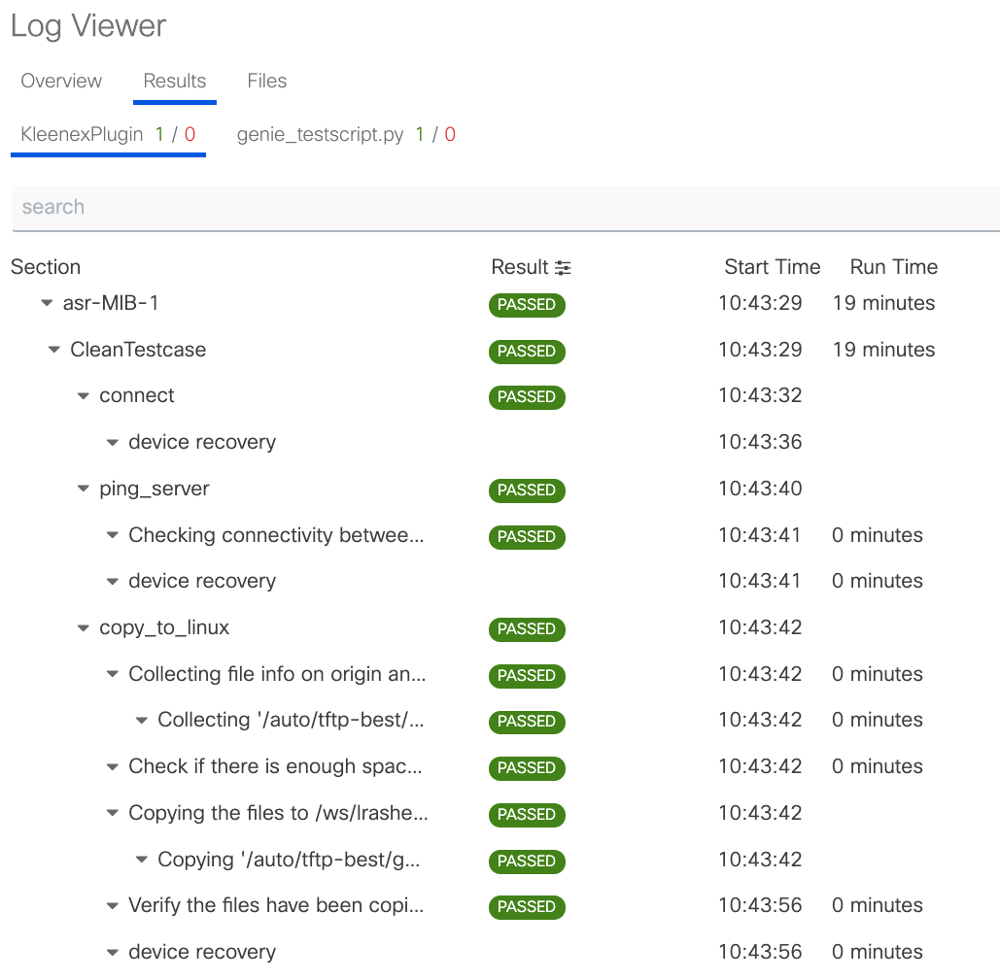

.. _clean:

pyATS Clean
===========
Built on top of the pyATS Kleenex infrastructure, pyATS clean library
enables you to restore your testbed’s devices to a known-good state by
loading your specified image and configuration. It can be added to any
existing pyATS script with using just a few additional arguments.

.. note::

     See clean yaml examples :ref:`here<base_clean_files>`

.. code-block:: bash

    # Quick start Guide!
    # ------------------
    # 1. Create the clean yaml
    # 2. Add the arguments
    # 3. (Optional) Relax while pyATS Clean takes care of everything

    # Standalone clean
    kleenex -testbed_file=/path/to/testbed.yaml -clean_file=/path/to/clean.yaml

    # Integrated with pyATS jobs
    pyats run job <job file> --clean-file /path/to/cleam.yaml --invoke-clean

You can find many examples in our `Github repo
<https://github.com/CiscoTestAutomation/examples/tree/master/clean>`_.

--------

.. figure:: structure.png
    :width: 350
    :align: right

Build like Lego building blocks, pyATS clean is highly modular. You can add,
remove and modify any stages, including customizing your own clean stage
anywhere in the process! This gives it the flexibility to support a variety
of platforms, each with its own tailored clean process/portfolio.

pyATS Clean is simplistic, the library is designed so you can use one clean
yaml structure for all your devices - regardless of operating system and platforms.

--------

For the first time, Clean logs are now easy to view and debug thanks to Xpresso
and our pyATS Logviewer. The logs and results can be viewed live as the run
happens by adding the `--liveview` argument to the pyats run command and
visiting http://localhost:8080/.

.. toctree::
   :maxdepth: 2

   design/design
   usage/usage
   examples/base_clean_files
   Available Clean Stages <https://pubhub.devnetcloud.com/media/genie-feature-browser/docs/#/clean>
