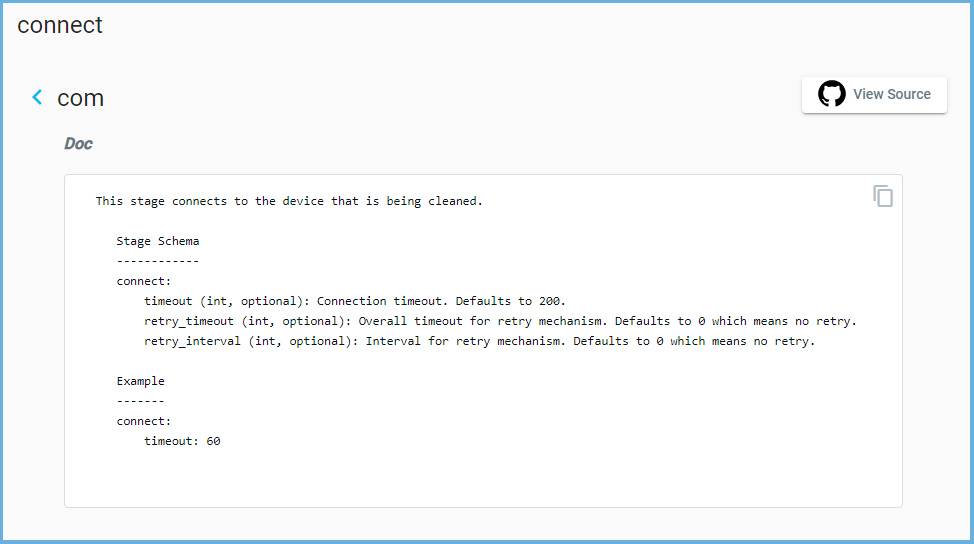

.. _clean_doc_quick_start_add_stages:

Defining a Stage (Clean Step)
=============================
In this section we will be adding a stage called `connect <https://pubhub.devnetcloud.com/media/genie-feature-browser/docs/#/clean/connect>`_.
A stage, in simple terms, is a step in the clean.

.. note::

    In the event you do not know what a stage is, what it does, and what arguments they accept, you can find that information
    in the :ref:`Clean Stages <clean_doc_clean_stages>` document.

In the image below (taken from the `Clean Stages Browser <https://pubhub.devnetcloud.com/media/genie-feature-browser/docs/#/clean>`_)
we can see this connect stage has a some arguments we can also change. The browser will tell you what arguments are available,
if it's an optional argument, the default values, and the type of value it takes.

We will change the connection timeout to `100` in the `Clean YAML`. For any optional arguments, if they are not defined,
the default value is used.

.. code-block:: yaml
    :linenos:
    :emphasize-lines: 12-13

    cleaners:
        # This means to use the cleaner class `PyatsDeviceClean`
        PyatsDeviceClean:
            # The module is where the cleaner class above can be found
            module: genie.libs.clean
            # You can define many devices within the Clean YAML.
            # Any that are not in this list are not cleaned even if they are defined below.
            devices: [PE1]

    devices:
        PE1:
            connect:
                timeout: 100

Next we need to provide the order of which our stages will execute in. To do this, simply add an `order` key at the same
level of hierarchy as `stages`. The `order` key is a list of stages we previously defined and is **executed** in the
**top-down order**.

.. code-block:: yaml
    :linenos:
    :emphasize-lines: 15-16

    cleaners:
        # This means to use the cleaner class `PyatsDeviceClean`
        PyatsDeviceClean:
            # The module is where the cleaner class above can be found
            module: genie.libs.clean
            # You can define many devices within the Clean YAML.
            # Any that are not in this list are not cleaned even if they are defined below.
            devices: [PE1]

    devices:
        PE1:
            connect:
                timeout: 100

            order:
            - connect

It is supported to add as many stages as needed. Below is an example of adding another stage called
`apply_configuration <https://pubhub.devnetcloud.com/media/genie-feature-browser/docs/#/clean/apply_configuration>`_
under `PE1` in the ``Clean YAML``.

It will run after the `connect` stage as defined under the `order` key.

.. code-block:: yaml
    :linenos:
    :emphasize-lines: 15-16, 20

    cleaners:
        # This means to use the cleaner class `PyatsDeviceClean`
        PyatsDeviceClean:
            # The module is where the cleaner class above can be found
            module: genie.libs.clean
            # You can define many devices within the Clean YAML.
            # Any that are not in this list are not cleaned even if they are defined below.
            devices: [PE1]

    devices:
        PE1:
            connect:
                timeout: 100

            apply_configuration:
                configuration: hostname PE1

            order:
            - connect
            - apply_configuration
