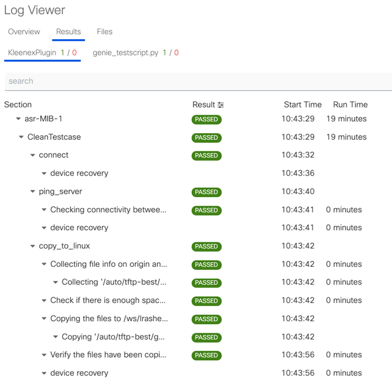

.. _clean_doc_log_viewer:
Viewing Clean Logs
==================

pyATS Clean logs are supported by the `pyATS Log Viewer <https://pubhub.devnetcloud.com/media/pyats/docs/cli/pyats_logs.html>`_.

For a very brief overview, you can enable liveview by adding the argument `--liveview` which will enable you to view
the logs in realtime.

As an alternative you can view the logs after the clean is finished by running::

    pyats logs view

Below is an example of what the log viewer webpage looks like.

