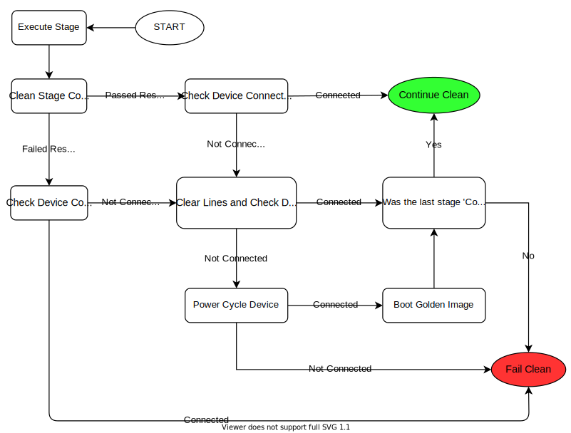

.. _clean_doc_device_recovery:
Device Recovery
===============

Before using your new `Clean` it is important to learn about `Device Recovery` as it is the **second most important** aspect to
pyATS Clean.

.. topic:: Topics covered in this section are:

    * `The Methodology Behind Device Recovery`_
    * `How Device Recovery Works`_
    * `How to Enable Device Recovery`_

The Methodology Behind Device Recovery
--------------------------------------

pyATS Clean provides a jack-of-all-trades for **recovering devices** that fail due to device malfunctions or if the clean
process itself fails to execute (see below for details). `Device Recovery` can clear the line of a device from the terminal server
and use a powercycler to restart the device. After restarting the device, `Device Recovery` will load the **golden image**
and optionally apply a configuration onto the device.

The major advantage the device recovery feature provides is—you can **recover a device and reset it back to a useable
state** regardless of the current state of the device.

How Device Recovery Works
-------------------------

Device Recovery is invoked after every stage and it will determine whether to continue or fail clean.

.. topic:: This may depend on:

    * The result of the last executed stage.
    * The connectivity to the device.
    * If the last stage ran was the `connect` stage.

**The following diagram explains, in detail, the flow of Device Recovery.**

How to Enable Device Recovery
-----------------------------

`Device Recovery` requires that you have an `Golden Image` for each device which is guaranteed to boot and function
correctly. This `Golden Image` can be kept on the device or on a tftp server which is accessible from the device. Once
you have the Golden Image, follow the steps below.

#. Add the required `Terminal Server` and/or `Power Cycler` information to the ``Testbed YAML``

    The example below shows where to add the `Terminal Server` and the `Power Cycler` information.

    .. note::

        See :ref:`Supported Power Cyclers <clean_doc_supported_pc>` for a list of available Power Cyclers and their
        respective arguments that can be used.

    .. code-block:: yaml
        :linenos:
        :emphasize-lines: 3-8, 10-12, 14-16

        devices:
          PE1:
            peripherals:
              power_cycler:
                - type: dualcomm
                  connect_type: snmp
                  host: 127.0.0.1
                  outlets: [22]

              terminal_server:
                # <terminal server device>: <list of lines for the device>
                # In this case, clearing line 22 would clear the line
                # connected to 'PE1'
                my-terminal-server: [22]

          my-terminal-server:
            # Fill out the rest of this device as normal
            # such as connection info, credentials, etc

#. Add the `device_recovery` section to the ``Clean YAML``.

    Below you can find the `Device Recovery` schema.

    .. code-block:: yaml
        :linenos:

        Clean YAML - Device Recovery Schema
        -----------------------------------
        devices:
          <device>:
            device_recovery:
              break_count (int): How many attempts to break the booting process once
                  either the console_activity_pattern or the grub_activity_pattern was
                  matched.

              console_activity_pattern (str, optional): Used only for devices with
                  rommon boot mode. Once the pattern is matched, breaking of the
                  boot process begins.

              console_breakboot_char (str, optional): Used in conjunction with
                  console_activity_pattern. This is the character(s) to send which should
                  break the rommon booting process.

              grub_activity_pattern (str, optional): Used only for devices with
                  grub boot mode. Once the pattern is matched, breaking of the
                  boot process begins.

              grub_breakboot_char (str, optional): Used in conjunction with
                  grub_activity_pattern. This is the character(s) to send which should
                  break the grub booting process.

              timeout (int): Maximum time in seconds to recover the device.

              recovery_password (str): Password to login to the device after the boot
                  process completes.

              powercycler (bool, optional): Should Device Recovery powercycle
                  the device. Defaults to True.

              powercycler_delay (int, optional): Powercycler delay between on and off in
                  seconds. Defaults to 30.

              reconnect_delay (int, optional): Once device recovered, delay before
                  final reconnect in seconds. Defaults to 60.

              clear_line (bool, optional): Should device recovery clear the lines.
                  Defaults to True.

              post_recovery_configuration (str, optional): Configuration to apply after
                  booting. Defaults to None.

              golden_image for NXOS
              ---------------------
              golden_image (dict, only if 'tftp_boot' from below is not defined):
                kickstart (str, optional): Golden kickstart image. Defaults to None.
                system (str, optional): Golden system image. Defaults to None.

              golden_image for others
              -----------------------
              golden_image (list, only if 'tftp_boot' from below is not defined): Image
                 to boot.

              tftp_boot (only if 'golden_image' from above is not defined):
                image (list): Image to boot with.
                ip_address (list): Management ip address to configure to reach to
                  the TFTP server.
                subnet_mask (str): Management subnet mask.
                gateway (str): Management gateway.
                tftp_server (str): Tftp server is reachable with management interface.

    Below you can find a `Device Recovery` example.

    .. code-block:: yaml
        :linenos:

        Clean YAML - Device Recovery Example
        ------------------------------------
        devices:
          PE1:
            device_recovery:
              grub_activity_pattern: '.*The highlighted entry will be executed automatically in.*'
              timeout: 600
              powercycler_delay: 5
              golden_image:
                - 'GOLDEN IMAGE'

That's it! Not as bad as it looked! Now `pyATS Clean` will handle cases where the device has malfunctioned or is otherwise
unreachable.