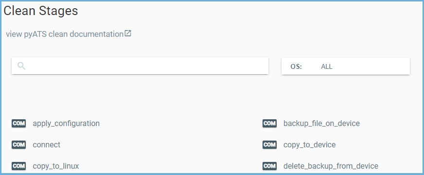

.. _clean_doc_clean_stages:
Intro to Stages (Clean Step)
============================

Before writing a `Clean` it is important to learn about `Clean Stages` as they are the **single most important** aspect to
pyATS Clean.

.. topic:: Topics covered in this section are:

    * `The Methodology Behind Clean Stages`_
    * `What Clean Stages are Available`_
    * `Developing New Clean Stages`_

The Methodology Behind Clean Stages
-----------------------------------

pyATS Clean is designed with a modular stage-based architecture and supports abstraction by following a directory
structure where each platform implementation is identified based on the `os` and `platform` of the device. This
provides a consistent, reusable, plug-and-play methodology for cleaning devices in a testbed.

You can add, remove, and modify any `Clean Stage` to suit your specific clean process, or os/platform requirements. This
gives pyATS Clean the flexibility to support a variety of platforms each with its own tailored clean process.

When grouped together, `Clean Stages` form steps that are executed in the `order` specified in the `Clean YAML` file and is
therefore highly customizable.

By dividing the clean workflow into smaller stages, this streamlines the development of the `Clean Stage`, promotes
code reuse, assists when debugging clean failures, and allows you to specify exactly what to run.

.. _clean_doc_available_clean_stages:
What Clean Stages are Available
-------------------------------

pyATS Clean has several `Clean Stages` that are standard of most user’s operational requirements for cleaning devices.
The below image is an example of the `Clean Stage Browser <https://pubhub.devnetcloud.com/media/genie-feature-browser/docs/#/clean>`_
where all available `Clean Stages` can be found.

.. note::

    The tokens that appear before the stage designate which OS the stage is available for. The ``COM`` token indicates
    "Common" to all supported OS types.

Once you find a suitable stage and want to learn more about it, click on the `Clean Stage` name to see the description and
arguments the `Clean Stage` accepts. Below is an example of what you can expect after clicking on the `connect` Clean Stage.

.. image:: ../../assets/clean_stage_browser_connect.png

The source code for the `Clean Stage` can also be found from the
`Clean Stage Browser <https://pubhub.devnetcloud.com/media/genie-feature-browser/docs/#/clean>`_ by clicking the
``View Source`` button as seen in the above image. The button will open a new tab in your browser to the exact file and
line number the `Clean Stage` code is located at.

Developing New Clean Stages
---------------------------

Additional stages can be added to meet your specific testing requirements with just a few steps.

It is expected user communities will contribute to the pyATS `Clean Stages` pool for supporting specifics of their given
os/platform or to close the gap on an any features.

Refer to the :ref:`Developer Guide <clean_doc_developer_guide>` documentation to get started in your development.