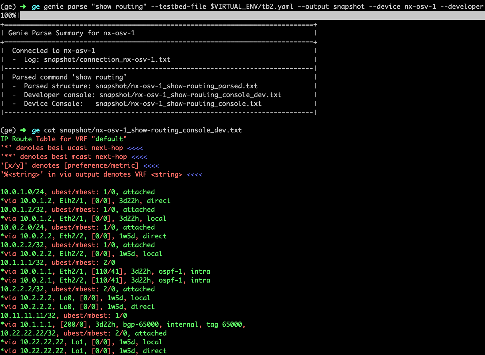

.. _cli_parse:

Genie Parse
===========

`genie parse` is used to execute and parse show-commands on your `device`
directly from a linux terminal. To see what functionality `genie parse`
offers, execute the following in your linux terminal:

.. code-block:: bash

    (genie) bash-4.1$ genie parse --help
    Usage:
      genie parse [commands] [options]

    Example
    -------
      genie parse "show interfaces" --testbed-file /path/to/testbed.yaml --devices uut
      genie parse "show interfaces" --testbed-file /path/to/testbed.yaml --devices uut --output my_parsed_output/
      genie parse "show interfaces" "show version" --testbed-file /path/to/testbed.yaml --devices helper

    Description:
      Parse CLI commands into Pythonic datastructures

    Parse Options:
      COMMANDS              Show command(s) to parse, all can instead be provided to parse all commands
      --testbed-file        TESTBED_FILE
                            specify testbed_file yaml
      --devices DEVICES     Devices to issue commands to
      --output OUTPUT       Directory to store output files to. When not provided, prints parsed JSON
      --via [VIA [VIA ...]]
                            List of connection to use per device "nxos-1:ssh"
                            output to screen.
      --fuzzy               Enable fuzzy matching for commands
      --raw                 Store device output without parsing it
      --timeout TIMEOUT     Devices execution timeout
      --developer           Parser coloured developer mode

    General Options:
      -h, --help            Show help
      -v, --verbose         Give more output, additive up to 3 times.
      -q, --quiet           Give less output, additive up to 3 times, corresponding to WARNING, ERROR,
                            and CRITICAL logging levels

The following is a list of parsers available for execution within `genie parse`:
:parsers:`Genie Parsers<http>`

The following is an example of using `genie parse` to execute and parse show-
command "show version" on `device` `nx-osv-1` of the `testbed.

.. code-block:: bash

    (genie) bash-4.1$ genie parse "show version" --testbed-file /path/to/testbed.yaml --devices nx-osv-1

      0%|                                                                    | 0/1 [00:00<?, ?it/s]
      {
      "platform": {
        "hardware": {
          "bootflash": "17602318 kB",
          "chassis": "None",
          "cpu": "E5-2699 v3 @ 2.30GHz",
          "device_name": "nx-osv-1",
          "memory": "16410728 kB",
          "model": "NX-OSv",
          "processor_board_id": "905KERP7AIA",
          "slots": "None"
        },
        "kernel_uptime": {
          "days": 0,
          "hours": 3,
          "minutes": 37,
          "seconds": 30
        },
        "name": "Nexus",
        "os": "NX-OS",
        "reason": "Unknown",
        "software": {
          "system_compile_time": "7/21/2016 8:00:00 [07/21/2016 16:09:32]",
          "system_image_file": "bootflash:///golden.image",
          "system_version": "7.0(3)I4(2)"
        }
      }
    }
    100%|############################################################| 1/1 [00:03<00:00,  3.14s/it]

As seen above, `genie parse` executes the show-command and then parses the
output line-by-line and prints a Python datastructure containing the parsed
data onto the linux terminal.

To save the parsed output, users can provide option `--output` with the name of
a directory to create. All parsed output will then be saved into this directory.

Let's try an example of parsing two show-commands and saving their output into
a specified directory:

.. code-block:: bash

    (genie) bash-4.1$ genie parse "show version" "show interface brief" --testbed-file /path/to/testbed.yaml --devices nx-osv-1 --output genie_parse
    100%|############################################################| 2/2 [00:04<00:00,  2.69s/it]
    +==============================================================================+
    | Genie Parse Summary for nx-osv-1                                                |
    +==============================================================================+
    |  Connected to nx-osv-1                                                          |
    |  -  Log: genie_parse/connection_nx-osv-1.txt                                    |
    |------------------------------------------------------------------------------|
    |  Parsed command 'show version'                                               |
    |  -  Parsed structure: genie_parse/nx-osv-1_show-version_parsed.txt              |
    |  -  Device Console:   genie_parse/nx-osv-1_show-version_console.txt             |
    |------------------------------------------------------------------------------|
    |  Parsed command 'show interface brief'                                       |
    |  -  Parsed structure: genie_parse/nx-osv-1_show-interface-brief_parsed.txt      |
    |  -  Device Console:   genie_parse/nx-osv-1_show-interface-brief_console.txt     |
    |------------------------------------------------------------------------------|

``Genie`` executed the commands "show version" and "show interface brief" on the
`devices` `nx-osv-1` in the `testbed` YAML. It then saved the parsed data
within the newly created directory "genie_parse".

`genie parse` generates 3 unique types of files:

1. `Unicon` telnet connection log
2. `device` console output (for each show command)
3. Parsed datastructure in JSON (for each show command)

The following is an example of the files that would be created, after executing
the linux command executed above:

.. code-block:: bash

    (genie) bash-4.1$ ls -l genie_parse/
    total 84
    -rw-r--r-- 1 ellewoods eng 13572 Jan 24 21:53 nx-osv-1_show-interface-brief_console.txt
    -rw-r--r-- 1 ellewoods eng 28126 Jan 24 21:53 nx-osv-1_show-interface-brief_parsed.txt
    -rw-r--r-- 1 ellewoods eng 14829 Jan 24 21:53 nx-osv-1_show-version_console.txt
    -rw-r--r-- 1 ellewoods eng   752 Jan 24 21:53 nx-osv-1_show-version_parsed.txt
    -rw-rw-rw- 1 ellewoods eng 14870 Jan 24 21:53 connection_nx-osv-1.txt
    (genie) bash-4.1$

The file 'genie_parse/connection_nx-osv-1.txt' contains the `Unicon` connection log
of telnet to the `device` on which the show-commands were executed.

As an example:

.. code-block:: bash

    (genie) bash-4.1$ more genie_parse/connection_nx-osv-1.txt
    [2019-01-24 06:33:03,618] +++ nx-osv-1 logfile genie_parse/connection_nx-osv-1.txt +++
    [2019-01-24 06:33:03,618] +++ Unicon plugin nxos +++
    [2019-01-24 06:33:03,623] +++ connection to spawn: telnet 172.25.194.13 9001, id: 4132314380 +++
    [2019-01-24 06:33:03,625] connection to nx-osv-1
    [2019-01-24 06:33:03,624] telnet 172.25.194.13 9001
    Trying 172.25.194.13...
    Connected to 172.25.194.13.
    Escape character is '^]'.

    nx-osv-1#
    [2019-01-24 06:33:04,334] +++ initializing handle +++
    [2019-01-24 06:33:04,335] +++ nx-osv-1: executing command 'term length 0' +++
    term length 0
    nx-osv-1#
    [2019-01-24 06:33:04,447] +++ nx-osv-1: executing command 'term width 511' +++
    term width 511
    nx-osv-1#
    [2019-01-24 06:33:04,558] +++ nx-osv-1: executing command 'terminal session-timeout 0' +++
    terminal session-timeout 0

The file 'genie_parse/nx-osv-1_show-interface-brief_console.txt' contains the raw
`device` console output of the show-commands "show interface brief" and "show
version

.. code-block:: bash

    (genie) bash-4.1$ more genie_parse/nx-osv-1_show-interface-brief_console.txt

    +++ nx-osv-1: executing command 'show interface brief' +++
    show interface brief

    -------------------------------------------------------------------------------- 
    Port   VRF          Status IP Address                              Speed    MTU  
    -------------------------------------------------------------------------------- 
    mgmt0  --           up      x.x.x.x                                 1000     1500

    -------------------------------------------------------------------------------- 
    Ethernet      VLAN    Type Mode   Status  Reason                   Speed     Port
    Interface                                                                    Ch #
    -------------------------------------------------------------------------------- 
    Eth1/1        1       eth  access up      none                       auto(D) --  
    Eth1/2        1       eth  access up      none                       auto(D) --  
    Eth1/3        1       eth  access up      none                       auto(D) --  

The file 'genie_parse/nx-osv-1_show-interface-brief_parsed.txt' contains the parsed
output of 'show interface brief' in JSON format. 

An example of the JSON created by `genie parse`

.. code-block:: bash

    (genie) bash-4.1$ more genie_parse/nx-osv-1_show-interface-brief_parsed.txt

    {
      "_meta_class": "ShowInterfaceBrief",
      "_meta_module": "show_interface",
      "_meta_os": "nxos",
      "interface": {
        "ethernet": {
          "Eth1/1": {
            "mode": "access",
            "port_ch": "--",
            "reason": "none",
            "speed": "auto(D)",
            "status": "up",
            "type": "eth",
            "vlan": "1"
          },
          "Eth1/2": {
            "mode": "access",
            "port_ch": "--",
            "reason": "none",
            "speed": "auto(D)",
            "status": "up",
            "type": "eth",
            "vlan": "1"
          },
          ...

`genie parse` efficiently handles errors such as empty show-command output,
parsing errors, unrecognized commands, etc.

For instance, if an unrecognized command is passed to `genie parse`, it simply
returns an error stating that the parser for the command was not found:

.. code-block:: bash

    (genie) bash-4.1$ genie parse "show banana" --testbed-file /path/to/testbed.yaml --devices nx-osv-1
    0%|                                                                      | 0/1 [00:00<?, ?it/s]
    Could not find parser for 'show banana'
    100%|############################################################| 1/1 [00:00<00:00, 23.55it/s]

`genie parse` is an extremely useful tool to validate the state of `device`'s
within a network. For more information, take a look at the Genie diff command!

`--developer` allows to verify which values is parsed in the output.

Green means it was parsed, and red means the value was not parsed.

`--fuzzy` enables fuzzy search, which allows you to use some regex syntax in 
your search to match multiple commands. By default, searching for command is
done by exact match or prefix matching, if no ambiguity exists.

Fuzzy matching works by tokenizing your search query by spaces, and then 
comparing each token with each of the command's token to see if they are either
the same or is the prefix of the other. When it encounters the supported regex 
expressions, it will perform regex matching as expected and return the results. 
The search is done by best fit, meaning it will try its best to fit your query
with each command, and if it succeeds, it will be counted as a match. As a 
result, arguments are essentially wild cards, and using fuzzy will attempt to
fit your query with the arguments in any way possible. For instance, 
`sh .* abc .*` will match with `show vrf {vrf} detail`. In this case `abc` is 
simply an argument for `vrf`.

Fuzzy current supports the follow regex symbols and their combinations:

- *
- [a-zA-Z0-9]
- +
- ?
- \s\S\w\W\d\D
- [^a-zA-Z0-9]
- (a|b)
- a{3}
- .

However, since lookup is done by one token at a time, this will limit the use of 
more complex regex expressions such as lookahead and greedy. Moreover, space is 
used as a delimiter, so to incorporate space in your query, use `\s` instead.

Here are some example of matches: 

+----------------------------------------------------------------------------------+
| Search                       |                                    Sample Results |
+==================================================================================+
| sh .* tags                   |                                show ethernet tags |
+------------------------------+---------------------------------------------------+
| sh .* abc .* ext             |             show ospf vrf {vrf} database external |
+------------------------------+---------------------------------------------------+
| sh .* [a-z]* ext\S+          |                       show ted database extensive |
|                              |                    show ospf3 interface extensive |
|                              |     show ospf vrf all-inclusive database external |
|                              |                                               ... |
+------------------------------+---------------------------------------------------+

`genie parse` also allows you to make rest get calls and collect JSON using ``--rest``.

For instance:

.. code-block:: bash

    genie parse /api/node/mo/uni/tn-SnV/flt-http.json --testbed-file ../../../blitz_testbed/testbed.yaml
     --devices APIC --output snap1 --rest

    100%|#################################################################| 1/1 [00:04<00:00,  4.71s/it]
    +==============================================================================+
    | Genie Parse Summary for APIC                                                 |
    +==============================================================================+
    |  Connected to APIC                                                           |
    |  -  Log: snap1/connection_APIC.txt                                           |
    |------------------------------------------------------------------------------|
    |  Parsed command '/api/node/mo/uni/tn-SnV/flt-http.json'                      |
    |  -  Parsed structure: snap1/APIC_-api-node-mo-uni-tn-SnV-flt-                |
    | http.json_parsed.txt                                                         |
    |  -  Device Console:   snap1/APIC_-api-node-mo-uni-tn-SnV-flt-                |
    | http.json_console.txt                                                        |
    |------------------------------------------------------------------------------|

The content of the "snap1/APIC_-api-node-mo-uni-tn-SnV-flt-http.json_parsed.txt" is:

.. code-block:: JSON

      {
        "imdata": [
          {
            "vzFilter": {
              "attributes": {
                "annotation": "",
                "childAction": "",
                "descr": "",
                "dn": "uni/tn-SnV/flt-http",
                "extMngdBy": "",
                "fwdId": "9",
                "id": "implicit",
                "lcOwn": "local",
                "modTs": "2020-09-21T13:52:14.247+00:00",
                "monPolDn": "uni/tn-common/monepg-default",
                "name": "http",
                "nameAlias": "",
                "ownerKey": "",
                "ownerTag": "",
                "revId": "10",
                "status": "",
                "txId": "8070450532247928980",
                "uid": "15374",
                "unsupportedEntries": "no",
                "unsupportedMgmtEntries": "no",
                "usesIds": "yes"
              }
            }
          }
        ],
        "totalCount": "1"
      }