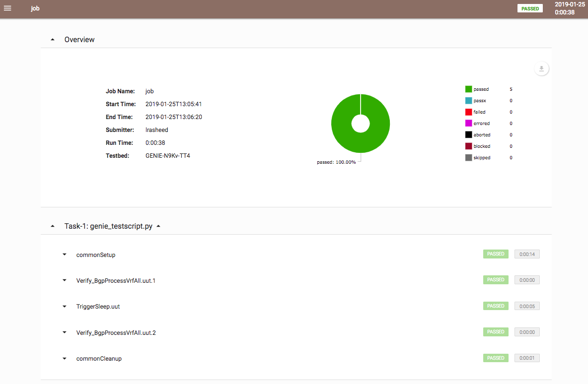

Genie Run
=========

`genie run` is a one-stop-shop tool for executing all the Python functionality
provided by ``Genie`` `harness` directly from linux command line. It eliminates
the need for creating and maintaining job-files and having working Python
knowledge prior to getting started with ``Genie``.

For more information on ``Genie`` `harness`, refer to the user guide:
https://pubhub.devnetcloud.com/media/genie-docs/docs/userguide/harness/index.html

`genie run` supports all arguments from ``Genie``, easypy and aetest.

For a complete list of arguments supported by `genie run` sub-components:

    1. :ref:`Genie Harness Documentation <harness_overview>`
    2. :easypy:`Easypy Arguments<http>`

To see what functionality `genie run` offers, execute the following in your
linux terminal:

.. code-block:: bash

    (genie) bash-4.1$ genie run --help

    usage: genie [--no-mail] [--mail-to] [--mail-subject] [--mail-html]
                 [--submitter] [--image] [--release] [--html-logs [DIR]]
                 [--xunit [DIR]] [--tims-post] [--tims-user] [--tims-dns]
                 [--tims-options] [--tims-folder] [--tims-custom-attrs]
                 [--tims-config-id] [--no-archive] [--runinfo-dir] [--archive-dir]
                 [--no-upload] [--bg-upload] [-t] [--clean-file FILE]
                 [--clean-devices [[...]]] [--clean-scope {job,task}]
                 [--invoke-clean] [--logical-testbed-file] [--rerun-file FILE]
                 [--rerun-condition  [...]] [-h] [-v] [-q] [--datafile FILE]
                 [--uids LOGIC] [--groups LOGIC] [--random] [--random-seed INT]
                 [--max-failures INT] [--pdb] [--step-debug FILE]
                 [--pause-on PAUSE_ON] [--trigger-datafile FILE]
                 [--verification-datafile FILE] [--trigger-file FILE]
                 [--verification-file FILE] [--pts-datafile FILE]
                 [--pts-features PTS_FEATURES] [--pts-golden-config FILE]
                 [--config-datafile FILE] [--verification-uids LOGIC]
                 [--trigger-uids LOGIC] [--verification-groups LOGIC]
                 [--trigger-groups LOGIC] [--mapping-datafile FILE]
                 [--subsection-datafile FILE] [--debug-plugin FILE]
                 [--filetransfer-protocol FILETRANSFER_PROTOCOL]
                 [-devices DEVICES]
                 [--tgn-skip-configuration TGN_SKIP_CONFIGURATION] [--tgn-enable]
                 [--tgn-traffic-convergence-threshold TGN_TRAFFIC_CONVERGENCE_THRESHOLD]
                 [--tgn-reference-rate-threshold TGN_REFERENCE_RATE_THRESHOLD]
                 [--tgn-first-sample-threshold TGN_FIRST_SAMPLE_THRESHOLD]
                 [--tgn-disable-traffic-post-execution TGN_DISABLE_TRAFFIC_POST_EXECUTION]
                 [--tgn-traffic-loss-recovery-threshold TGN_TRAFFIC_LOSS_RECOVERY_THRESHOLD]
                 [--tgn-traffic-loss-tolerance-percentage TGN_TRAFFIC_LOSS_TOLERANCE_PERCENTAGE]
                 [--tgn-enable-traffic-loss-check TGN_ENABLE_TRAFFIC_LOSS_CHECK]
                 [--tgn-config-post-device-config TGN_CONFIG_POST_DEVICE_CONFIG]
                 [--tgn-profile-snapshot-threshold TGN_PROFILE_SNAPSHOT_THRESHOLD]
                 [--tgn-routing-threshold TGN_ROUTING_THRESHOLD]
                 [--tgn-port-list TGN_PORT_LIST]
                 [--tgn-arp-wait-time TGN_ARP_WAIT_TIME]
                 [--tgntcl-enable-arp TGNTCL_ENABLE_ARP]
                 [--tgntcl-learn-after-n-samples TGNTCL_LEARN_AFTER_N_SAMPLES]
                 [--tgntcl-stream-sample-rate-percentage TGNTCL_STREAM_SAMPLE_RATE_PERCENTAGE]
                 [--tgntcl-wait-multiplier TGNTCL_WAIT_MULTIPLIER] [-C FILE]

    Easypy command line arguments.
    Non-recognized args will pass-through to the user job file.

    Example
    -------
      genie /path/to/jobfile.py
      genie /path/to/jobfile.py -testbed_file /path/to/testbed.yaml

    --------------------------------------------------------------------------------

    Configuration:
      -C, --configuration FILE    easypy configuration yaml file for plugins

    Mailing:
      --no-mail                   disable report email notifications
      --mail-to                   list of report email recipients
      --mail-subject              report email subject header
      --mail-html                 enable html format report email

    Reporting:
      --submitter                 Specify the current submitter user id
      --image                     Specify the image under test
      --release                   Specify the release being tested
      --xunit [DIR]               Generate xunit report in the provided location. If used as a flag, generates xunit reports runtime directory

    HTML Logging:
      --html-logs [DIR]           Experimental feature. Directory to generates HTML logs in addition to any existing log files.
                                  Note - will increase archive size due to log duplication.

    TIMS:
      --tims-post                 Enable posting results to tims
      --tims-user                 TIMS user. If not specified, the userstarting the run is used
      --tims-dns                  TIMS project dns name
      --tims-options              A string in the form of -key value sequence.
                                  (Add a space at the beginning of the string to work around python parser bug. e.g. -a 1
      --tims-folder               A TIMS 3.x ID, a Logical ID or a complete, fully-qualified path
      --tims-custom-attrs         A str of dashed key/value pairs
                                  e.g. -key1 val1 -key2 val2. The key value pairs are fed to TIMS as global custom attributes
      --tims-config-id            TIMS config_id, maps to Configuration ID, Related Config or logical identifier

    Runinfo:
      --no-archive                disable archive creation
      --runinfo-dir               specify alternate runinfo directory
      --archive-dir               specify alternate archive directory
      --no-upload                 Disable uploading archive to TRADe
      --bg-upload                 Upload to TRADe in background

    Testbed:
      -t, --testbed-file          Specify testbed file location

    Clean:
      --clean-file FILE           Specify clean file location
      --clean-devices [ [ ...]]   Specify list of devices to clean, separated by spaces.  To clean groups of devices sequentially, specify as "[[dev1, dev2], dev3]".
      --clean-scope {job,task}    Specify whether clean runs before job or per task
      --invoke-clean              Clean is only invoked if this parameter is specified.

    Bringup:
      --logical-testbed-file      Specify logical testbed file location

    Rerun:
      --rerun-file FILE           rerun.results file that contains the information of tasks and testcases
      --rerun-condition  [ ...]   Results type list for the condition of rerun plugin.

    General Options:
      -h, --help                  Show help information
      -v, --verbose               Give more output, additive up to 3 times.
      -q, --quiet                 Give less output, additive up to 3 times, corresponding to WARNING, ERROR, and CRITICAL logging levels

    Input Datafile:
      --datafile FILE             input datafile, supplementing the script
                                  with additional feature enablement & values

    Execution Control:
      --uids LOGIC                logic string matching section uids to run.
                                  eg: -uids="And('.*setup.*', 'test.+')"
      --groups LOGIC              logic string matching testcase groups to be run.
                                  eg: -ids="And('sanity', 'regression')"
      --random                    flag to randomize the execution of testcases
      --random-seed INT           seed value for testcase randomization
      --max-failures INT          max number of failures before script abandon

    Debugging:
      --pdb                       start the interactive debugger on failure
      --step-debug FILE           file containing the debug command to run specific step
      --pause-on PAUSE_ON         Pauses the testscript when there is a matching phrase in the log messages

    Genie arguments:
      --trigger-datafile FILE     Trigger configuration datafile
      --verification-datafile     FILE
                                  VerificationTrigger configuration datafile
      --trigger-file FILE         Trigger configuration file
      --verification-file FILE    VerificationTrigger configuration file
      --pts-datafile FILE         PTS configuration datafile
      --pts-features PTS_FEATURES
                                  Features to learn for pts
      --pts-golden-config FILE    Golden configuration file
      --config-datafile FILE      File containing configuration information
      --verification-uids STR     string matching verifications uids to run.
                                  eg: -uids="Verify_IpOspfNeighborDetail_vrf_all Verify_IpRoute_protocol_bgp"
                                  or: -uids="And('Verify_IpOspfNeighborDetail_vrf_all',
                                             'Verify_IpRoute_protocol_bgp')"
      --trigger-uids STR          string matching triggers uids to run.
                                  eg: -uids="TriggerShutNoShutEthernetInterface TriggerAddRemoveAdvertiseEvpnMulticast"
                                  or: -uids="And('TriggerShutNoShutEthernetInterface',
                                             'TriggerAddRemoveAdvertiseEvpnMulticast')"
      --verification-groups LOGIC
                                  logic string matching verifications groups to be run.
                                  eg: -ids="And('sanity', 'regression')"
      --trigger-groups LOGIC      logic string matching triggers groups to be run.
                                  eg: -ids="And('sanity', 'regression')"
      --mapping-datafile FILE     File containing device to connection mapping
      --subsection-datafile FILE  File containing Common_(setup/cleanup)subsection information
      --debug-plugin FILE         File pointing to debug plugin
      --filetransfer-protocol     FILETRANSFER_PROTOCOL
                                  File transfer protocol to be used in the run
      -devices DEVICES            List of devices to connect to

    Genie Tgn arguments:
      --tgn-skip-configuration    TGN_SKIP_CONFIGURATION
                                  Allows user to skip loading configuration onto TGN device if it has been configured prior to Genie run.
      --tgn-enable                Enable subsection 'initialize_traffic'.
                                  Performs the following tasks:
                                  * Connect to TGN device
                                  * Load TGN configuration
                                  * Learn TGN traffic streams
                                  Create snapshot profile of traffic streams
                                  Default value is False.
      --tgn-traffic-convergence-threshold TGN_TRAFFIC_CONVERGENCE_THRESHOLD
                                  Wait time (seconds) to allow traffic streams to coverge to steady state.
                                  Default value is 60 seconds.
      --tgn-reference-rate-threshold TGN_REFERENCE_RATE_THRESHOLD
                                  Wait time (seconds) before checking traffic stream rates to create profile snapshot.
                                  Default value is 100 seconds.
      --tgn-first-sample-threshold TGN_FIRST_SAMPLE_THRESHOLD
                                  Wait time (seconds) before collecting the first sample of traffic stream rates.
                                  Default value is 15 seconds.
      --tgn-disable-traffic-post-execution TGN_DISABLE_TRAFFIC_POST_EXECUTION
                                  Allows user to stop traffic *AFTER* Genie has completed execution. This is useful for manual debugging after Genie runs complete.
                                  Default value is False.
      --tgn-traffic-loss-recovery-threshold TGN_TRAFFIC_LOSS_RECOVERY_THRESHOLD
                                  Wait time (seconds) for allowing traffic to recover to steady state AFTER a traffic loss was observed (say during trigger execution).
                                  Default value is 5 seconds.
      --tgn-traffic-loss-tolerance-percentage TGN_TRAFFIC_LOSS_TOLERANCE_PERCENTAGE
                                  Maximum allowable traffic loss percentage.
                                  Default value is 15 percent.
      --tgn-enable-traffic-loss-check TGN_ENABLE_TRAFFIC_LOSS_CHECK
                                  Enable checking of traffic loss after every trigger that is executed by Genie.
                                  Default value is True.
      --tgn-config-post-device-config TGN_CONFIG_POST_DEVICE_CONFIG
                                  Configure TGN device ONLY AFTER device configuration is successfully applied.
                                  Default value is True.
      --tgn-profile-snapshot-threshold TGN_PROFILE_SNAPSHOT_THRESHOLD
                                  Wait time (seconds) to collect reference rate while creating traffic snapshot profile.
                                  Default is 1200 seconds.
      --tgn-routing-threshold TGN_ROUTING_THRESHOLD
                                  Wait time (seconds) after enabling TGN routing engine and before starting traffic.
                                  Default value is 120 seconds.
      --tgn-port-list TGN_PORT_LIST
                                  Ports on the traffic generator device to connect to during Genie execution.
                                  Default value is empty
      --tgn-arp-wait-time TGN_ARP_WAIT_TIME
                                  Time to wait after sending ARP on interfaces before verifying ARP/ND successfully resolved.
                                  Default value is 60 seconds
      --tgntcl-enable-arp TGNTCL_ENABLE_ARP
                                  Send ARP to TGN device
      --tgntcl-learn-after-n-samples TGNTCL_LEARN_AFTER_N_SAMPLES
                                  Create traffic profile after N number of samples
      --tgntcl-stream-sample-rate-percentage TGNTCL_STREAM_SAMPLE_RATE_PERCENTAGE
                                  Specifies percentage tolerance that two samples of the same stream group must be within to be considered "the same"
      --tgntcl-wait-multiplier TGNTCL_WAIT_MULTIPLIER
                                  Multiplier to increase the wait time for creating a traffic profile snapshot. This argument multiples the value of 'tgn_profile_snapshot_threshold'.

Running Triggers & Verifications
--------------------------------

Let's use `genie run` to execute a sample script containing 1 trigger and 1
verification. The linux CLI to do so would be:

.. code-block:: bash

    genie run --testbed-file /path/to/testbed.yaml \
              --trigger-uids="TriggerShutNoShutBgp" \
              --verification-uids="Verify_BgpProcessVrfAll" \
              --devices nxos-osv-1 \
              -- html_logs .

Let's examine each of those arguments above in more detail:

1. '--trigger-uids' and/or '--trigger-groups' arguments are used to specify 
which `Trigger`'s to execute from ``Genie``. Complete list of Triggers available
 to execute within ``Genie``: :triggers:`Available Genie Triggers<http>`

When both '--trigger-uids' and '--trigger-groups' are provided, both will be 
used to elect triggers from trigger datafile.

For more information on how a ``Genie`` `Trigger` works, refer to:
:ref:`Genie Trigger Documentation <getting_trigger>`

2. '--verification-uids' and/or '--verification-groups' arguments can be used 
to specify which `Verification`'s to execute from ``Genie``. Complete list of 
Verifications available to execute within ``Genie``: :triggers:`Available Genie Verifications<http>`

When both '--verification-uids' and '--verification-groups' are provided, both 
will be used to elect verifications from verification datafile.

For more information on how a ``Genie`` `Verification` works, refer to:
:ref:`Genie Verification Documentation <getting_verification>`

3. By default, `genie run` executes on all devices specified in the `testbed`
YAML file. Use argumnet '--devices <name of device>' to execute the `Trigger`'s
and `Verification`'s on a specific device.

4. In order to create viewable logs, provide option '--html-logs .' to specify
that the logfile should be created in the directory we are running from.

.. note::

    1. Ensure the `device`'s that we are exeucting triggers and verifications
       on have a connection marked as 'cli' within the `testbed` YAML. For more
       information, refer to the documentation on:
       :ref:`Control Device Connections <book_genie_connection_control>`

    2. In case the `device`'s in the `testbed` YAML does not have any connections
       marked as 'cli', provide argument '--mapping-datafile' containing the
       `device` mapping details to `genie run`. For more information, refer to
       the documentation on :ref:`Mapping Datafile <mapping_datafile>`

Once `genie run` completes, you can see a table summarizing the results of the
`Trigger`'s and `Verification`'s that were executed. The following is a sample:

.. code-block:: bash

    2019-01-25T13:06:24: %EASYPY-INFO: +------------------------------------------------------------------------------+
    2019-01-25T13:06:24: %EASYPY-INFO: |                                Easypy Report                                 |
    2019-01-25T13:06:24: %EASYPY-INFO: +------------------------------------------------------------------------------+
    2019-01-25T13:06:24: %EASYPY-INFO: pyATS Instance   : /ws/ellewoods/genie
    2019-01-25T13:06:24: %EASYPY-INFO: Python Version   : cpython-3.4.1 (32bit)
    2019-01-25T13:06:24: %EASYPY-INFO: CLI Arguments    : /ws/ellewoods/genie/bin/genie run --testbed-file /ws/ellewoods/genie/genie_testbeds/genie_n9kv_tt4.yaml --trigger-uids=And('TriggerSleep') --verification-uids=And('Verify_BgpProcessVrfAll$') -device uut --html-logs .
    2019-01-25T13:06:24: %EASYPY-INFO: User             : ellewoods
    2019-01-25T13:06:24: %EASYPY-INFO: Host Server      : ssr-oper-gen.cisco.com
    2019-01-25T13:06:24: %EASYPY-INFO: Host OS Version  : Red Hat Enterprise Linux Server 6.9 Santiago (x86_64)
    2019-01-25T13:06:24: %EASYPY-INFO:
    2019-01-25T13:06:24: %EASYPY-INFO: Job Information
    2019-01-25T13:06:24: %EASYPY-INFO:     Name         : job
    2019-01-25T13:06:24: %EASYPY-INFO:     Start time   : 2019-01-25 13:05:41.914951
    2019-01-25T13:06:24: %EASYPY-INFO:     Stop time    : 2019-01-25 13:06:19.755553
    2019-01-25T13:06:24: %EASYPY-INFO:     Elapsed time : 0:00:37.840602
    2019-01-25T13:06:24: %EASYPY-INFO:     Archive      : /ws/ellewoods/genie/users/ellewoods/archive/19-01/job.2019Jan25_13:05:40.871779.zip
    2019-01-25T13:06:24: %EASYPY-INFO:
    2019-01-25T13:06:24: %EASYPY-INFO: Total Tasks    : 1
    2019-01-25T13:06:24: %EASYPY-INFO:
    2019-01-25T13:06:24: %EASYPY-INFO: Overall Stats
    2019-01-25T13:06:24: %EASYPY-INFO:     Passed     : 5
    2019-01-25T13:06:24: %EASYPY-INFO:     Passx      : 0
    2019-01-25T13:06:24: %EASYPY-INFO:     Failed     : 0
    2019-01-25T13:06:24: %EASYPY-INFO:     Aborted    : 0
    2019-01-25T13:06:24: %EASYPY-INFO:     Blocked    : 0
    2019-01-25T13:06:24: %EASYPY-INFO:     Skipped    : 0
    2019-01-25T13:06:24: %EASYPY-INFO:     Errored    : 0
    2019-01-25T13:06:24: %EASYPY-INFO:
    2019-01-25T13:06:24: %EASYPY-INFO:     TOTAL      : 5
    2019-01-25T13:06:24: %EASYPY-INFO:
    2019-01-25T13:06:24: %EASYPY-INFO: Success Rate   : 100.00 %

    2019-01-25T13:06:24: %EASYPY-INFO: +------------------------------------------------------------------------------+
    2019-01-25T13:06:24: %EASYPY-INFO: |                             Task Result Summary                              |
    2019-01-25T13:06:24: %EASYPY-INFO: +------------------------------------------------------------------------------+
    2019-01-25T13:06:24: %EASYPY-INFO: Task-1: commons.commonSetup                                               PASSED
    2019-01-25T13:06:24: %EASYPY-INFO: Task-1: base.Verify_BgpProcessVrfAll.uut.1                                PASSED
    2019-01-25T13:06:24: %EASYPY-INFO: Task-1: sleep.TriggerSleep.uut                                            PASSED
    2019-01-25T13:06:24: %EASYPY-INFO: Task-1: base.Verify_BgpProcessVrfAll.uut.2                                PASSED
    2019-01-25T13:06:24: %EASYPY-INFO: Task-1: commons.commonCleanup                                             PASSED
    2019-01-25T13:06:24: %EASYPY-INFO:
    2019-01-25T13:06:24: %EASYPY-INFO: +------------------------------------------------------------------------------+
    2019-01-25T13:06:24: %EASYPY-INFO: |                             Task Result Details                              |
    2019-01-25T13:06:24: %EASYPY-INFO: +------------------------------------------------------------------------------+
    2019-01-25T13:06:24: %EASYPY-INFO: Task-1: commons
    2019-01-25T13:06:24: %EASYPY-INFO: |-- commonSetup                                                           PASSED
    2019-01-25T13:06:24: %EASYPY-INFO: |   |-- connect                                                           PASSED
    2019-01-25T13:06:24: %EASYPY-INFO: |   |-- configure                                                        SKIPPED
    2019-01-25T13:06:24: %EASYPY-INFO: |   |-- configuration_snapshot                                            PASSED
    2019-01-25T13:06:24: %EASYPY-INFO: |   |-- save_bootvar                                                      PASSED
    2019-01-25T13:06:24: %EASYPY-INFO: |   |-- learn_system_defaults                                             PASSED
    2019-01-25T13:06:24: %EASYPY-INFO: |   `-- initialize_traffic                                               SKIPPED
    2019-01-25T13:06:24: %EASYPY-INFO: |-- Verify_BgpProcessVrfAll.uut.1                                         PASSED
    2019-01-25T13:06:24: %EASYPY-INFO: |   `-- verify                                                            PASSED
    2019-01-25T13:06:24: %EASYPY-INFO: |-- TriggerSleep.uut                                                      PASSED
    2019-01-25T13:06:24: %EASYPY-INFO: |   `-- sleep                                                             PASSED
    2019-01-25T13:06:24: %EASYPY-INFO: |-- Verify_BgpProcessVrfAll.uut.2                                         PASSED
    2019-01-25T13:06:24: %EASYPY-INFO: |   `-- verify                                                            PASSED
    2019-01-25T13:06:24: %EASYPY-INFO: `-- commonCleanup                                                         PASSED
    2019-01-25T13:06:24: %EASYPY-INFO:     |-- verify_configuration_snapshot                                     PASSED
    2019-01-25T13:06:24: %EASYPY-INFO:     `-- stop_traffic                                                     SKIPPED

`genie run` will also create a logfile named "TaskLog.html" that contains the
complete logs of all the `Trigger`'s and `Verification`'s executed and are
viewable in any browser.

The following is a sample log report:

Recording with Genie
--------------------

`genie run` in combination with :unicon_recording:`Unicon Recording<http>`
is capable of *recording* and saving all interactions with any `device`.

Simply provide argument '--record' to any `genie` CLI command and the path to the
directory into which recordings should be saved. `Unicon` will record all
interactions with the `device` and create a pickle file under the directory
specified. This file can later be unpicked using `genie unpickle`.

Let's look at an example of using `Unicon` record with `genie learn`:

.. code-block:: bash

    (genie) bash-4.1$ genie run --testbed-file /path/to/testbed.yaml \
                                --trigger-uids="TriggerShutNoShutBgp" \
                                --verification-uids="Verify_BgpProcessVrfAll" \
                                --devices nxos-osv-1 \
                                --html_logs . \
                                --record recorded_session

The above `genie run` command will do exactly as above however, it will record
all `device` interactions into the directory specified in '--record'.

Recording device interacations is an extremely useful feature! It enables users
to easily reproduce complicated issues observed on devices such as unexpected
`device` outputs or crashes/traceback triggers etc

Replaying with Genie
--------------------

`genie run` in combination with :unicon_replay:`Unicon Replay<http>` is capable
of *replaying* a saved `Unicon` recording to mimic all interactions with any
`device`.

Simply provide argument '--replay' to any `genie` CLI command and the path
containing the saved pickled `Unicon` recording. `Unicon` will then replay the
contents of the pickled file as a `Mock` device providing inputs to prompts as
needed.

Let's look at an example of using `Unicon` replay with `genie learn`:

.. code-block:: bash

    (genie) bash-4.1$ genie run --testbed-file /path/to/testbed.yaml \
                                --trigger-uids="TriggerShutNoShutBgp" \
                                --verification-uids="Verify_BgpProcessVrfAll" \
                                --devices nxos-osv-1 \
                                --html_logs . \
                                --replay recorded_session

The above `genie run` command will do exactly as above however, it will replay
all `device` interactions from the directory specified in '--replay' instead of
executing commands on actual device.

Once again, replaying a device recording is an extremely useful functionality
in network automation! It significantly improves the ease of debugging issues
reported on network `device`'s. Users can now simply request a recording of any
issue and replay it to reproduce an issue for debugging.

For more information on the `Unicon.playback` package refer to the
:unicon_playback:`Unicon Playback Documentation<http>`

.. note::

    Ensure your python virtual environment has `Unicon` version 3.4.6 or higher
    installed, in order to use the `Unicon.playback` record/replay features.
