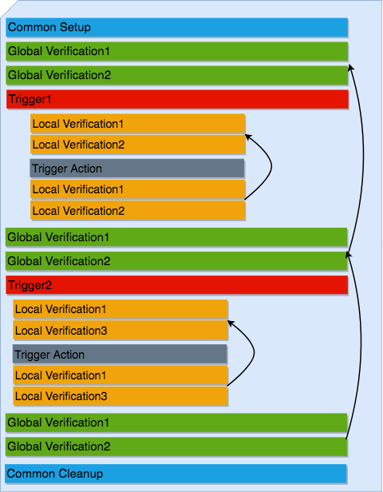

.. _book_harness:

.. raw:: html

   <h2>Genie Harness Recipes</h2>

.. note::

    This section assumes pyATS and Genie are :ref:`installed and ready to be
    used<book_genie>`.

.. note::

    It also assumes you have a :ref:`testbed file ready<book_setup_testbed>` to
    be used with a device.

1. Summary
----------

.. note::

    This section gives a summary of what is Genie Harness. Dig into the documentation for more information.

Writing a future-proof automation script is a complex topic. It seems simple
at first, but then as the devices update, things changes, there are new
requirement and it all become spaghetti; and the whole process restarts again.

With Genie harness, we've taken this complex topic and made it simple. We've
taken a divide and conquer approach to this problem. Multiple packages and
libraries were created with Genie harness being the last piece to create a
resilient and future-proof automation solution. In short, we've made lasagna
with many modules stacked on top of each other.

Genie harness provides comprehensive common tools so that users can focus on
writing tests without having to reinvent the wheel!

Once the tests are written, the harness is then driven by :ref:`yaml
datafiles<datafile>`. The files control the whole flow of the execution:

* :ref:`connect to all the devices<book_harness_connect>`
* :ref:`configure the devices<book_harness_configure>`
* :ref:`Verify the configuration was applied correctly<book_harness_golden>`
* :ref:`snapshot of the configuration<book_harness_configuration>` and compared at the end of the run
* :ref:`snapshot of the operation state<book_harness_profile>` of your devices to be compared at the end of the run
* :triggers:`pool of available tests <http>` (triggers and verifications, over 500) which works across
  multiple Operating systems
* :ref:`connections pool<book_harness_pool>` - Learn and send commands to the device in parallel
* :ref:`traffic Generator<book_harness_traffic>`
* much more

Genie Harness is fully modular; everything can be customized; modified for your
automation need.

* New subsections can be added and removed
* Decide which triggers and verifications to execute and in which order
* Create your own triggers and verifications
* Add local verifications to any trigger
* Add processor anywhere
* Static information for each trigger
* Much more!

2. What's the flow of Genie Harness
-----------------------------------

The flow of Genie Harness is divided into 3 main sections.

Common Setup
^^^^^^^^^^^^

Get the devices ready and collect some information:

   a. Connect to your devices
   b. Configure your device (optional)
   c. Setup Traffic Generator if needed
   d. Take a snapshot of the system

Triggers and Verifications
^^^^^^^^^^^^^^^^^^^^^^^^^^

Execute triggers and verification to perform tests on your devices.

Common Cleanup
^^^^^^^^^^^^^^

Make sure the state of the devices are the same as in common Setup

   a. Take a new snapshot and compare with the original snapshots from Common
   Setup
   b. Stop traffic

.. note::

    You can add your own :ref:`subsections<book_harness_subsection>` within the
    common setup and cleanup.

The triggers and verifications are where the action is happening! Let's first
define trigger and verification.

**Trigger**: Perform actions on the device to test it. In most case the the
state of the device is reverted to what it was before the trigger started.

**Verifications**: The first time a verification is run, it takes a snapshot of
some commands; the next time, the same command is executed and compare with
this initial snapshot to make sure the state has not changed.

**Global Verification**: A Global verifications are run between each trigger.
(Optional)

**Local Verification**: Independent of the Global verifications, only run
within a trigger with a new snapshot taken at the beginning of the trigger.
(Optional)

The first time a Global or a Local verification is executed, a snapshot is
taken and subsequent verifications then compare with this snapshot.

Within the Common Setup, features can also be profiled. The profile takes an
:ref:`ops<book_ops_summary>` snapshot, which is then compared in the Common
Cleanup. This is very powerful to find any unexpected side effect to some
feature.

.. note::

    A verification can also be :ref:`callable<harness_user_callable>`, where
    you decide what should pass and fail.

.. note::

    This is the typical Harness flow, however, everything can be customized

.. _book_harness_started:

3. Getting started with the Harness
-----------------------------------

To execute your first Genie you need the following three items.

1) testbed file

    Follow the :ref:`testbed file ready<book_setup_testbed>`.

2) job file

    A job file starts the execution of Genie.

.. code-block:: python

    import os

    from pyats.datastructures.logic import And, Not, Or
    from genie.harness.main import gRun

    def main():

        # trigger_uids limit which test to execute
        # verification_uids limit which test to execute
        gRun(trigger_uids=['TriggerSleep'],
             verification_uids=['Verify_InterfaceBrief'])

.. code-block:: bash

    pyats run <job file>.py --testbed-file <path to testbed file>

This will run ``Genie`` with 1 trigger and 1 verification.

.. note::

   This is very similar to the first Genie :ref:`example`.

.. raw:: html

    

.. raw:: html

    <a href="../_static/TaskLog.html">logs</a>
    

.. _book_harness_connect:

4. Summary of each datafile
---------------------------

Genie uses at most 7 datafiles.

Testbed Datafile (Mandatory)
^^^^^^^^^^^^^^^^^^^^^^^^^^^^

The testbed datafile describes the testbed information. Available devices, how
to connect to them,  server, interfaces, etc.

* :ref:`Quick guide on setting up testbed datafile<book_genie>`
* :testbed:`pyATS Documentation on testbed datafile<http>`

Mapping Datafile (Optional)
^^^^^^^^^^^^^^^^^^^^^^^^^^^

The mapping datafile create the relation between the testbed datafile and Genie,
it is only needed if user wants to connect to multiple devices controling the
connection type for each device. Otherwise, ``Genie`` will only connect to `uut`.

* :ref:`All the information on how to use the mapping datafile<book_harness_mapping>`
* :ref:`Mapping datafile schema<pts_datafile>`

Verification Datafile (Optional)
^^^^^^^^^^^^^^^^^^^^^^^^^^^^^^^^

The verification datafile contains all the information on the verifications.
If no verification datafile is provided, the default datafile
`$VIRTUAL_ENV/lib/python<version>/site-packages/genie/libs/sdk/genie_yamls/<uut os>/verification_datafile_<uut os>.yaml`
is then used.

It is only needed to provide a new verification datafile if you want to modify
the default file; otherwise the default one is all you need.

* :ref:`Select which verifications to execute<book_harness_verification_execute>`
* :ref:`Modify existing verifications<book_harness_verification_argument>`
* :ref:`Create a new verification<book_harness_verification_new>`
* :ref:`Verification datafile schema<verification_datafile>`

.. note::

    For example <uut os> can be nxos

Trigger Datafile (Optional)
^^^^^^^^^^^^^^^^^^^^^^^^^^^

The trigger datafile contains all the information on the triggers.
If no trigger datafile is provided, the default datafile
`$VIRTUAL_ENV/lib/python<version>/site-packages/genie/libs/sdk/genie_yamls/<uut os>/trigger_datafile_<uut os>.yaml`
is then used.

It is only needed to provide a new trigger datafile if you want to modify the
default file; otherwise the default one is all you need.

* :ref:`Select which triggers to execute<book_harness_trigger_execute>`
* :ref:`Modify existing triggers<book_harness_trigger_argument>`
* :ref:`Create a new trigger<book_harness_trigger_new>`
* :ref:`Trigger datafile schema<trigger_datafile>`

.. note::

    For example <uut os> can be nxos

Subsection Datafile (Optional)
^^^^^^^^^^^^^^^^^^^^^^^^^^^^^^

The subsection datafile contains all the information on the subsection.
If no subsection datafile is provided, the default datafile
`$VIRTUAL_ENV/lib/python<version>/site-packages/genie/libs/sdk/genie_yamls/subsection_datafile.yaml`
is then used.

It is only needed to provide a new subsection datafile if you want to modify the
default file; otherwise the default one is all you need.

* :ref:`Create a new subsection<book_harness_subsection>`
* :ref:`Subsection datafile schema<subsection_datafile>`

.. note::

    A subsection is a section of Common setup or Common cleanup.

Configuration Datafile (Optional)
^^^^^^^^^^^^^^^^^^^^^^^^^^^^^^^^^

The configuration datafile contains all the information on how to configure the
device. If no subsection datafile is provided, then the devices are not configured.

* :ref:`Create a new subsection<book_harness_subsection>`
* :ref:`Configuration datafile schema<config_datafile>`

PTS Datafile (Optional)
^^^^^^^^^^^^^^^^^^^^^^^

The PTS datafile contains all the information on what to profile in the common
setup and cleanup. If no PTS datafile is provided, the default datafile
`$VIRTUAL_ENV/lib/python<version>/site-packages/genie/libs/sdk/genie_yamls/pts_datafile.yaml`
is then used.

It is only needed to provide a new profile datafile if you want to modify the
default file; otherwise the default one is all you need.

* :ref:`Profile the system<book_harness_profile>`
* :ref:`PTS datafile schema<pts_datafile>`

.. note:: PTS stands for Profile The System

5. How to connect to your devices with the Harness?
----------------------------------------------------

Each device must be defined in the Testbed file and in the Mapping datafile
either by name or device alias like in the above recipe.

.. _book_harness_pool:

6. Connection pool with the harness
-----------------------------------

Using a :connection-pool:`connection pool <http>` is a huge performance boost!
Instead of sending all the commands one after the other, they are sent in
parallel!

As long as your device can accept multiple connections on the same port, then
its ready to be used, for example, the management port.

The mapping datafile must be modified to add the pool size.

.. code-block:: python

    devices:
        uut:
           pool_size: 2
           context: cli
           mapping:
             # Associate cli with connection a
             cli: vty

This will initialize 2 connections to the uut and the cli commands will go up
to twice as fast! This number can scale up to what your device can support.

In order to use connection pool for different connections, the new mapping schema needs to be followed.
``Note``: via and alias keywords are mandatory when using new mapping schema.
.. code-block:: python

    devices:
      uut:
        mapping:
          context:
              cli:
               - via: cli
                 alias: cli1
                 pool_size: 2
              yang:
               - via: yang
                 alias: netconf
                 pool_size: 3

.. note::

    Make sure the device can support multiple connection. Take a look at the
    :ref:`vty connection<book_genie_extra_connection>`.

.. _book_harness_configure:

7. How to apply the configuration to your devices?
--------------------------------------------------

There are 3 ways to apply configuration on your devices.

1) Configure the devices before the run gets started.

    Just telnet to each device and configure them manually.

2) Apply the configuration in the common setup on the devices with
   tftp/scp/ssh.

   This is done by passing information in the `configuration datafile`.

3) Create a new subsection and configure the devices.

More information on the :ref:`getting started -
configuration<harness_configuration>` documentation.

.. _book_harness_configuration:

8. What does the `configuration_snapshot` and `verify_configuration_snapshot` sections do ?
-------------------------------------------------------------------------------------------

In a typical Genie run, the triggers do not modify the configuration of the
device. Each action is either nondestructive or reverts the configuration.

These two sections verify that the configuration has not changed. The
`configuration_snapshot` take a snapshot of the configuration and
`verify_configuration_snapshot` verify it hasn't changed.

Some configuration might want to be ignored as there might have dynamic values.
In the :ref:`configuration datafile<harness_configuration>` add to the key
`exclude_config_check` a list of value to exclude.

.. code-block:: yaml

    exclude_config_check: ['some configuration', '(certificate self-signed.*')]

.. note::

    regex expression is supported when the string is surrounded with
    parentheses

.. _book_harness_profile:

9. What is the purpose of `Profiling` in `Common Setup` and `Common Cleanup` ?
------------------------------------------------------------------------------

The above recipe verifies that the configuration has not changed; this section
deals with the operation state.  Re-using our :ref:`Ops object<book_ops>` we
take a snapshot at the beginning of the run and one at the end and we compare
the state using our :ref:`diff object<book_ops_diff>`.

If any trigger changed the operational state of a feature, this last check will
flag it up.

.. _book_harness_traffic:

10. How to add Traffic Generator to Genie Harness and how do they help to test?
-------------------------------------------------------------------------------

For Traffic generator - take a look at the :ref:`traffic documentation<traffic_harness>`

11. Where can I see all the arguments which Genie harness supports?
-------------------------------------------------------------------

All the arguments are documented right :ref:`here<harness_arguments>`!

12. What is a datafile schema
-----------------------------

The schema datafiles define the expected format of the file and provide all
the capabilities which are supported. The schemas must be respected for all
datafile in pyATS and Genie.

All Genie schemas can be found on the :ref:`datafile<datafile>` page.

.. _book_harness_extends:

13. How does the `extends` field work for Datafiles?
----------------------------------------------------

Use this field to extend an existing yaml testbed file, allowing you to create
an inheritance hierarchy.  Supports full path/names or a name of a file in the same dir.  The content of the last file on the list forms the base and is
updated with the preceding file, and so on until the existing file content is
updated last. Using extends is optional; but very useful to modify existing
datafiles.

.. _book_harness_verification_execute:

14. Select which verifications to execute
-----------------------------------------

Within the job file or as an easypy :ref:`argument<harness_arguments>` you can
use `-verification_uids` or `-verification_groups` argument to select which
verifications to execute.

The :ref:`verification datafile schema<verification_datafile>` explains all the
capabilities that the verifications support.

Visit our documentation to view the list of all available
:verifications:`verification <http>`.

.. note::

    groups are added in the verification datafile

.. _book_harness_verification_argument:

15. Modify existing Verification arguments
------------------------------------------

All verifications are defined in the verification yaml datafile which defines
how to load each verification, arguments to provide and on which device to
execute. The default datafiles can be found at
`$VIRTUAL_ENV/lib/python<version>/site-packages/genie/libs/sdk/genie_yamls/verification_datafile.yaml` and
`$VIRTUAL_ENV/lib/python<version>/site-packages/genie/libs/sdk/genie_yamls/<uut os>/verification_datafile_<uut os>.yaml`.

To modify any of the value for the verification you have to

1) create a new yaml datafile which extends from the main one.
2) Modify the value

Now refer to this datafile when launching Genie with the
`-verification_datafile` argument.

.. _book_harness_verification_new:

16. Write a new verification
----------------------------

A verification can be of three types.

1) Command bases verification - A parser is called and the structure is compared
2) Ops based verification - An Ops object is called and the structure is compared
3) Callable based verification - Do as you wish

Visit the :ref:`developer guide on verification<harness_verification>` for more
detail.

.. _book_harness_trigger_execute:

17. Select which trigger to execute
-----------------------------------

Within the job file or as an easypy :ref:`argument<harness_arguments>` you can
use `--trigger-uids` and/or `--trigger-groups` argument to select which
triggers to execute.

When both '--trigger-uids' and '--trigger-groups' are provided, both will be
used to elect triggers from trigger datafile.

The :ref:`trigger datafile schema<trigger_datafile>` explains all the
capabilities that the triggers support.

Visit our documentation to view the list of all available :trigger:`triggers<http>`.

.. code-block:: python

    gRun(trigger_uids=['TriggerUnconfigConfigBgp', 'TriggerShutNoShutEthernetInterface', 'TriggerUnconfigConfigBgp'])

.. note::

    groups are added in the trigger datafile

.. _book_harness_trigger_argument:

18. Modify existing triggers arguments
--------------------------------------

All triggers are defined in the trigger yaml datafile which defines
how to load each trigger, arguments to provide and on which device to
execute. The default datafiles can be found at
`$VIRTUAL_ENV/lib/python<version>/site-packages/genie/libs/sdk/genie_yamls/trigger_datafile.yaml` and
`$VIRTUAL_ENV/lib/python<version>/site-packages/genie/libs/sdk/genie_yamls/<uut os>/trigger_datafile_<uut os>.yaml`.

To modify any of the value for the trigger you have to:

1) create a new yaml datafile which extends from the main one.
2) Modify the value

Now refer to this datafile when launching Genie with the
`-trigger_datafile` argument.

To modify the actual code and not only the arguments, please visit our
:commit:`commit <http>` guideline.

.. _book_harness_trigger_new:

19. Write a new trigger
-----------------------

A trigger is a set of actions and verifications that, together, constitute a
testcase.

Visit the :ref:`developer guide on trigger<harness_trigger>` for more
detail.

20. Apply configuration to your devices
---------------------------------------

Genie provides the possibility to apply full configuration on the device in the
Common Setup. The configurations file are copied on the device and then applied.
The configuration yaml datafile is provided with the `config_datafile` argument.

Here is an example of the configuration yaml file. Provide the location of the
configuration, any sleep time if it takes times to stabilize on the device.

.. code-block:: python

    devices:
        uut:
            1:
              config: /path/to/my/configuration
              sleep: 3
              invalid: ['overlaps', '(.*inval.*)']
            2:
              config: <full path>
              sleep: 2

It also requires a valid :ref:`server<file_transfer_protocol>` to transfer the
files to the devices.

Take a look at the :ref:`full documentation <harness_configuration>` for more
information.

.. _book_harness_profile:

21. Profile the system
----------------------

Profiling the system allow to take snapshot at the begining of the run, and
compare with the same feature at the end of the run. This is useful to make
sure no feature was altered in an non expected way.

All :parsers:`available device command<http>` and all :models:`Ops features
<http>` can be profiled.

Here how to profile a feature:

.. code-block:: text

    gRun(pts_features=['platform', 'show ip route vrf default',
                       'show ip ospf interface',
                       'show ip ospf interface vrf default',
                       'show ip ospf vrf default', 'show vrf detail'])

All feature to be profiled are defined in the PTS (profile the system) yaml
file which defines which keys to **exclude**, arguments to provide and on which
device to execute. The default datafiles can be found at
`$VIRTUAL_ENV/lib/python<version>/site-packages/genie/libs/sdk/genie_yamls/pts_datafile.yaml`.
All parsers does not need to be added to this file, and will exclude all keys
defined in the Verification datafile.

More information in the :ref:`PTS<PTS>` getting started page.

.. note::

    This section complement the above section on profiling :ref:`Profiling
    <book_harness_profile>`.

.. note::

    To reduce execution time, PTS is designed with concurrent execution in
    profiling.

.. _book_harness_golden:

22. Golden PTS
--------------

After applying the configuration on the device in the Common Setup; we are
waiting for some time for the system to stabilize. However, how to know if it
has stabilized as expected?

The Golden PTS is a snapshot from a previous run to compare the PTS objects with.
If there are differences, the section will fail and the run will not continue.

.. _book_harness_mapping:

23. What can you do with the mapping datafile
---------------------------------------------

The mapping datafile create the relation between the testbed datafile and
Genie. By concept, the testbed datafile describes the testbed in general for any
script that wants to use this testbed. For Genie, we need to know more
information such as:

1. What connection to use for Cli action, for Yang action, Xml, etc
2. Provide connection pool information per device
3. Overwrite devices alias
4. Which connection type to prioritize for the run
5. Support for multiple connections per context(cli/yang/etc) with new schema

It is optional to have a mapping datafile. ``Genie`` will connect to all devices
(defined in testbed yaml file) only if no mapping datafile is provided.

An example can be found in the :ref:`getting started<book_harness_started>`.
The :ref:`datafile schema<pts_datafile>` contains the syntax on how to set the
datafile.

.. code-block:: yaml

    devices:
        uut:
           context: cli
           pool_size: 5
           mapping:
             # Associate cli with connection vty
             cli: vty
             yang: yang

The multiple connections are supported in mapping datafile, by the new schema:
``Note``: via and alias keywords are mandatory when using new mapping schema.

.. code-block:: python

    devices:
      uut:
        mapping:
          context:
              cli:
               - via: ssh
                 alias: cli
                 pool_size: 2

.. _book_harness_subsection:

24. Add/Remove subsections
--------------------------

With the `Subsection datafile,` all sections in Genie can be customized. You can
add, remove and even modify subsections. You can also change the execution
order. The default datafile can be found at
`$VIRTUAL_ENV/lib/python<version>/site-packages/genie/libs/sdk/genie_yamls/subsection_datafile.yaml`.

Here are the steps on how to create a new subsection.

1. Create a new subsection
2. Create a new subsection datafile which extends from the main one
3. Add the new subsection to the subsection datafile
4. Give it an order

Good to go!

To remove a subsection; just remove it from the order list. A subsection which
is not in the order list will not be executed.

1. Create a new subsection datafile which extends from the main one
2. Remove the subsection from the order.

25. Processors
--------------

:processors:`Processors <http>` are functions which are scheduled to run
immediately before and after any sections.

Processors can be added before and after common setup, Common cleanup, any
subsection, trigger, trigger section, and verification.

Within their corresponding :ref:`datafile <datafile>` processor can be added for
these sections.

Let's write a processor to run after a trigger to verify that the devices are
still alive.

.. code-block:: python

    def are_device_alive(section):
        # Find uut device
        testbed = section.parameters['testbed']
        for name, dev in testbed.devices.items()
            dev.execute('')

Now let's add it to one of our trigger. We are picking nxos for now, you can
pick the os desired. To add a processor; we need to add it to the trigger
datafile.

.. code-block:: yaml

    extends: "%CALLABLE{genie.libs.sdk.genie_yamls.datafile(trigger, nxos)}"
    TriggerSleep:
        processor:
            post:
                AreDeviceAlive:
                    method: processor.are_device_alive

It's now time to execute this trigger.

26. How to re-use existing Triggers/Verifications within an existing pyATS Script.
----------------------------------------------------------------------------------

All triggers and verifications can be re-used within pyATS. They can be either
run as a Testcase, or within a testcase depending of the need.

More information on :ref:`pyats_harness` documentation.

27. What kind of examples is there for Genie Harness?
-----------------------------------------------------

All the examples can be found in the :ref:`example<example>` page.

28. Update verification snapshots
---------------------------------

Within a trigger or a processor; one of the verification snapshots might need to
be re-taken.

The snapshots are stored at the testscript level in a dictionary named verf;
then indexed by devices. By deleting the snapshot, a new one will be
automatically taken the next time the verification is executed.

.. code-block:: python

    def re_take_snapshot(section):
        # Find uut device
        testbed = section.parameters['testbed']
        for name, dev in testbed.devices.items()
            del section.parent.verf[name]['Verify_Interface']

29. Randomize Triggers
----------------------

By default triggers are always run following their order in the list. By adding --random then
the triggers will run in a random order.

.. code-block:: python

    gRun(pts_features=['platform', 'bgp', 'interface'],
         verification_uids=['Verify_IpInterfaceBrief', 'Verify_IpRoute_vrf_all'],
         trigger_uids=['TriggerUnconfigConfigBgp.uut', 'TriggerShutNoShutBgpNeighbors', 'TriggerModifyLoopbackInterfaceIp.uut', 'TriggerShutNoShutEthernetInterface'],
         random=True)

Randomization seed integer can be used to fix the randomizer and re-generate
the same testcase sequence, useful for debugging purposes. The seed can be
found in the log `Testcase randomization is enabled, seed: 1868797651672894108`

.. code-block:: python

    gRun(pts_features=['platform', 'bgp', 'interface'],
         verification_uids=['Verify_IpInterfaceBrief', 'Verify_IpRoute_vrf_all'],
         trigger_uids=['TriggerUnconfigConfigBgp.uut', 'TriggerShutNoShutBgpNeighbors', 'TriggerModifyLoopbackInterfaceIp.uut', 'TriggerShutNoShutEthernetInterface'],
         random=True, randomize_seed=1868797651672894108)

.. _book_harness_cluster:

30. Trigger containing multiple Triggers and Verifications
----------------------------------------------------------

Multiple triggers and verificaiton can be executed within a single Trigger.

In the Trigger datafile:

.. code-block:: text

    TriggerCluster:
        sub_verifications: ['Verify_BgpVrfAllAll']
        sub_triggers: [ 'TriggerSleep', 'TriggerShutNoShutBgp']
        sub_order: ['TriggerSleep', 'Verify_BgpVrfAllAll', 'TriggerSleep', 'TriggerShutNoShutBgp', 'Verify_BgpVrfAllAll']
        devices: ['uut']

Which will provide this

.. code-block:: text

    -- TriggerCluster.uut                                                    PASSED
       |-- TriggerSleep_sleep.1                                              PASSED
       |-- TestcaseVerificationOps_verify.2                                  PASSED
       |-- TriggerSleep_sleep.3                                              PASSED
       |-- TriggerShutNoShutBgp_verify_prerequisite.4                        PASSED
       |   |-- Step 1: Learning 'Bgp' Ops                                    PASSED
       |   |-- Step 2: Verifying requirements                                PASSED
       |   |-- Step 3: Merge requirements                                    PASSED
       |-- TriggerShutNoShutBgp_shut.5                                       PASSED
       |   |-- Step 1: Configuring 'Bgp'                                     PASSED
       |-- TriggerShutNoShutBgp_verify_shut.6                                PASSED
       |   |-- Step 1: Verifying 'Bgp' state with ops.bgp.bgp.Bgp            PASSED
       |-- TriggerShutNoShutBgp_unshut.7                                     PASSED
       |   |-- Step 1: Unconfiguring 'Bgp'                                   PASSED
       |-- TriggerShutNoShutBgp_verify_initial_state.8                       PASSED
       |   |-- Step 1: Verifying ops 'Bgp' is back to original state         PASSED
       |-- TestcaseVerificationOps_verify.9                                  PASSED

This allow you to create ANY combination of triggers and verification into 1
trigger; a cluster trigger.

:ref:`More details<genie_harness_cluster>`

31. Loop a Trigger
------------------
It is possible to loop over a trigger multiple times using the `loop` feature of `aetest`.
This is useful for cutting down on unnecessary repetition in a testcase and improving efficiency.
Read more on it here: `AETest Loop <https://pubhub.devnetcloud.com/media/pyats/docs/aetest/loop.html>`_

A simple example of this is as follows:

.. code-block:: python

    from pyats import aetest
    from genie.harness.base import Trigger

    @aetest.loop(uids=['Test1', 'Test2', 'Test3'])
    class TriggerAetestLoop(Trigger):
        @aetest.test
        def test(self, testbed, steps):
            print(self.uid)

This will run the trigger three times, with each trigger having and
printing the uids 'Test1', 'Test2', 'Test3'

Loops can be extended by using a loop generator

.. code-block:: python

    from pyats import aetest
    from pyats import easypy
    from pyats.aetest.loop import Iteration

    class TestCaseGenerator(object):
        def __init__(self, loopee):
            self.uid = loopee.uid

        def __iter__(self):
            for i in range(3):
                yield Iteration(
                    uid = 'Test' + str(i+1),
                    parameters = {'num': i+1}
                )

    @aetest.loop(generator=TestCaseGenerator)
    class TriggerAetestLoop(Trigger):
        @aetest.test
        def test(self, testbed, steps, num):
            print(num)

Using a loop generator allows for each iteration of the trigger to be more uniquely defined.
In the above example, we are yielding three `Iteration` that sets the `uid` to the strings
'Test1', 'Test2', 'Test3'. We are also able to pass it a dictionary of parameters, in this
case it's a single parameter of `num` which will be the numbers 1 through 3.

32. Run command or API on failure
---------------------------------
It's possible to run a command or API at the end of your test section using the `post_execute_command`
processor, but did you know that you're able to specify which result to run the command on?

If for example, you wanted to run a command if and only if the section failed, you would pass
`valid_section_results = ['failed']` to the `post_execute_command` processor.

This can be done with both standalone aetest and genie harness like so:

**Standalone**

.. code-block:: python
    :caption: standalone_processor_example.py

    # pyATS
    from pyats import aetest
    from pyats import topology

    # Genie
    from genie.libs.sdk.libs.abstracted_libs.processors import post_execute_command

    # Decorator for running processors
    @aetest.processors(post = [post_execute_command])
    class RunPostProcessor(aetest.Testcase):
        @aetest.setup
        def Setup(self, testbed):

            # Connect to testbed
            testbed.connect()

            # Fail testcase and run command
            self.failed('Failing')

    if __name__ == '__main__':
        aetest.main(
            testscript=__file__,

            # Load topology and assign it to `testbed` parameter
            testbed=topology.loader.load('testbed.yaml'),

            # Set `devices` parameter to define which commands you would like to run
            devices = {
                'uut': {
                    'cmds': [
                        {'cmd': 'command_1'},
                        {'cmd': 'command_2'},
                        {'cmd': 'command_3'},
                    ],
                    'apis': [{
                        'api': 'get_bgp_summary',
                        'arguments': {
                            'vrf': 'blue'
                        }
                    }]
                }
            },

            # Set `valid_section_results` parameter to define what state to run
            # commands on which devices. Default is all states
            valid_section_results=[
                'failed'
            ]
        )

You can copy this, change the necessary variables, and run it with `python standalone_processor_example.py`

**Genie Harness**

.. code-block:: python
    :caption: harness_processor_job_example.py

    # Import Genie run
    from genie.harness.main import gRun

    def main():
        gRun(
            trigger_datafile='pyats_processor_test_trigger.yaml',
            trigger_uids='ProcessorTrigger',
            testbed="testbed.yaml"
            )

.. code-block:: python
    :caption: harness_processor_testcase_example.py

    # pyATS
    from pyats import aetest

    # Genie
    from genie.harness.base import Trigger

    # Trigger setup to fail
    class ProcessorTrigger(Trigger):
        @aetest.setup
        def Setup(self):
            self.failed('Failed')

.. code-block:: yaml
    :caption: harness_processor_trigger_example.py
    :emphasize-lines: 15,16

    ProcessorTrigger:
        source:
            class: "harness_processor_testcase_example.ProcessorTrigger"
        devices:
            - &uut device_name
        processors:
            post:
                post_execute:
                    method: genie.libs.sdk.libs.abstracted_libs.processors.post_execute_command
                    valid_section_results:
                        - 'failed'
                    parameters:
                        devices:
                            *uut:
                                cmds:
                                    - cmd: 'show version'
                                apis:
                                    - api: get_bgp_summary
                                      arguments:
                                          vrf: blue
                                    - api: my_custom_api
                                      module: my_module
                                      arguments:
                                        vrf: yellow

You can specify a python module name using the `module` option to load the module and call your custom API.
The device object and arguments specified under `arguments` will be passed to the API method.

An example module and API is shown below.

.. code-block:: python
    :caption: my_module.py

    import logging
    log = logging.getLogger(__name__)

    # Example python API
    def my_custom_api(device, **kwargs):
        device.execute('show version')
        if kwargs.get('vrf') == 'yellow':
            log.info('Collecting info for yellow VRF')
            ...

You can copy this, change the necessary variables, and run it with `pyats run job harness_processor_job_example.py`

33. Repeated execution of Triggers
----------------------------------

To execute a trigger multiple times, use the `order` definition in the trigger datafile.
You can provide a list of trigger names to execute and repeat the same trigger as needed.

.. code-block:: yaml
    :caption: trigger-data.yaml

    # extend the default triggers
    extends: "%CALLABLE{genie.libs.sdk.genie_yamls.datafile(trigger)}"

    order:
    - TriggerSleep
    - TriggerSleep

As of release 23.1, you can provide a list of dictionaries with trigger data.
This allows triggers to be execute repeatedly with different settings.

.. code-block:: yaml
    :caption: trigger-data.yaml

    # extend the default triggers
    extends: "%CALLABLE{genie.libs.sdk.genie_yamls.datafile(trigger)}"

    order:
    - TriggerSleep:
        sleep_time: 4
        message_time: 2
        devices: [uut1, uut2]
    - TriggerSleep:
        sleep_time: 10
        message_time: 1
        devices: [uut3, uut4]
