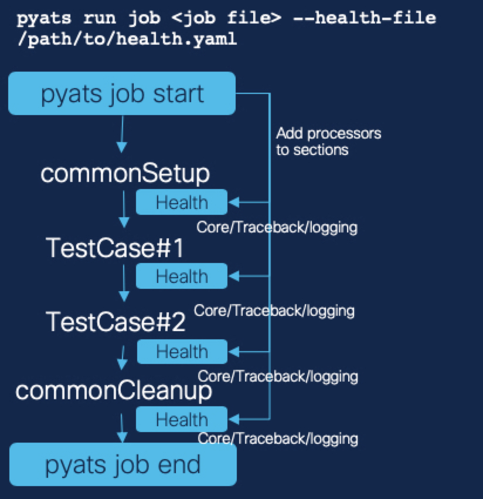
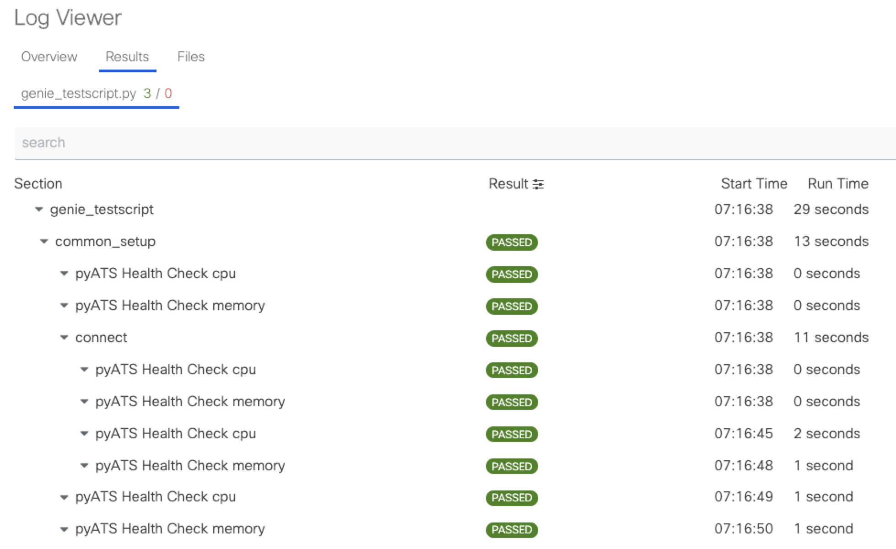

Design
======

The previous page showed you how to use pyATS Health Check easily. This page is for those who want to use their own pyATS Health Check. If you are happy with the way it was done on the previous page, then please move on :ref:`processor key in YAML<processor_key_in_yaml>`.

You can collect and monitor the state of your devices as your testscript is executing with pyATS Health Check. It can collect traceback, core files, etc. pyATS Health Check is yaml driven and it is based on :ref:`Blitz<blitz>`. All Blitz functionalities are supported in Health Check.

The health check is driven by a `health_file` which is provided at run time. There are two different mechanism to run the checks:

1. Part of a pre/post processor of a section or testcase.
2. Continuous data collection using a background process (Coming with 21.7).

To use your own pyATS Health Checks, you can specify pyATS Health Checks by leveraging the existing :ref:`Blitz<blitz>` style YAML format as it uses the same format and capabilities that Blitz has.
The actions in pyATS Health Check yaml will be added to pyATS job's sections as pre/post processors. Execution of the actions as pre, post or both can be specified in the yaml.

.. note::

     See the detail of :ref:`Blitz<blitz>`

.. code-block:: bash

    # Quick start Guide!
    # ------------------
    # 1. Create the health yaml
    # 2. Add `--health-file` argument to pyats command
    # 3. Run the job and verify issues found by the pyATS Health Check if any

    # Integrated with pyATS jobs
    pyats run job <job file> --testbed-file /path/to/testbed.yaml --health-file /path/to/health.yaml

.. note::

     Devices for pyATS Health Check need to be specified in the health yaml file and the testbed yaml for the pyATS job to execute health checks against the device.

     The pyATS testbed object will be converted to Genie testbed object to have Genie functionalities.

--------

Create health.yaml with knowledge about pyATS Blitz and then add the argument `--health-file` with the filename. pyATS Health Check will add Blitz actions as processors to sections in pyATS job. pyATS Health Check processors will run before and after each section (as specified) to monitor/collect device status as specified in the health yaml file.

Even for development of health yaml, the health file makes developer's life easier. It's the same format as the Blitz format and the health file can run like Blitz as well. So, develop and test as Blitz first and just switch the argument from `--trigger-datafile` to `--health-file` when health yaml is ready.

pyATS Health Check comes with default checks; however it is fully open-sourced! You can add your own checks to be executed at any time! Any features or functions to monitor, those can be contributed and developed as Blitz actions or APIs.

.. note::

     See all the available APIs for pyATS Health Check `Available Apis <https://pubhub.devnetcloud.com/media/genie-feature-browser/docs/#/apis>`_

--------

pyATS Health Check's added processors can be easily found in pyATS or XPRESSO logviewer. The processor results are added with a `pyATS Health Check` label and also icons for both `Pre` and `Post`.

`pyATS Health Check` is highly flexible and extendable. One of the biggest advantage is, leveraging Blitz style YAML format. Whatever can be possible in pyATS Health Check as long as it's supported/implemented with Blitz way.

Develop testcase(trigger-datafile) with Blitz and develop pyATS Health Check yaml with same way! It's very straight forward and very quick to start pyATS Health Check!

.. note::

     See the detail of :ref:`Blitz<blitz>`

pyATS Health Check yaml
-----------------------

Here is the pyATS Health Check yaml. It's almost same with `Blitz`! There are a few consideration to run it as pyATS Health Check. All the things are written as below comments in the yaml. If no comments, it means these items are exact same with `Blitz`.

.. code-block:: yaml

    # testcase name should be `pyats_health_processors`
    pyats_health_processors:
      groups: ["test"]
      # specify pyATS Health Check class instead of Blitz one
      source:
        pkg: genie.libs.health
        class: health.Health
      test_sections:
        # section name. this name will appear in Logviewer
        - cpu:
            - api:
                device: uut
                # `processor` is only for pyATS Health Check. Not for Blitz
                # Explained the detail in next section
                processor: both
                # `function` can be found from Genie Feature Browser
                # Please find the link to the page from bottom of this section
                function: health_cpu
                arguments:
                  command: show processes cpu
                  processes: ['BGP I/O']
        - memory:
            - api:
                device: uut
                processor: post
                function: health_memory
                arguments:
                  command: show processes memory
                  processes: ['\*Init\*']
                include:
                  - sum_value_operator('value', '<', 90)

.. note::

  All available APIs and Parsers can be found here `Genie Feature Browser <https://pubhub.devnetcloud.com/media/genie-feature-browser/docs/#/>`_

.. _processor_key_in_yaml:

processor key in YAML
---------------------

`processor` key is introduced for pyATS Health Check. It enables you to control if the section in pyATS Health Check run as `pre and post processor` , `pre-processor`, or `post-processor`.

Here is the list of options for `processor` key in YAML and how it works.
If no `processor` key in YAML is given, default is `both`. So, pyATS Health Check attach the sections/actions as both pre and post processors to pyATS job.

.. csv-table::
   :header: "processor", "behavior"
   :widths: 10, 10

   both (default), run as pre and post processor
   pre, run as only pre processor
   post, run as only post processor
   post_if_pre_execute, run as post processor. But it requires pre processors run before

Regarding `post_if_pre_execute`, sometimes post-processors need result/information from pre-processor. For example, get a route in pre-processor and verify the route in post-processor. In that case, the `post_if_pre_execute` is useful to make sure pre-processor is done before.

reconnect feature
-----------------

`reconnect` feature can be enabled in YAML, which is useful when device is crashed/reloaded. And it's very easy to use. If you want to reconnect to device in case device is disconnected due to crash/reload/etc, just add below one line in health yaml.

.. code-block:: yaml

  pyats_health_processors:
    source:
      pkg: genie.libs.health
      class: health.Health
    reconnect: # <<<<<
    test_sections:
      - traceback:
          - api:

By default, reconnect `max_time` 900 secs and `interval` 60 secs. `max_time` is for how long pyATS Health Check is going to retry the reconnection. `interval` is sleep time between attempt of reconnection when the previous one failed.

The `max_time` and `interval` can be configured by adding those under `reconnect` section like below.

.. code-block:: yaml

  pyats_health_processors:
    source:
      pkg: genie.libs.health
      class: health.Health
    reconnect:
      max_time: 360 # <<<<<
      interval: 45  # <<<<<
    test_sections:
      - traceback:
          - api:

.. _select_testcase_section:

Selecting Testcase/Section
--------------------------

pyATS Health Check processors are running before and after
every testcase and section by default.

However, you can select which testcase and which sections
to execute pyATS Health checks.

There are four ways to select where health checks run.
By default pyATS Health Checks run before and after
every testcase and section. With the filtering you
can decide where they are executed.

These arguments can be provided either via the CLI or via the Health YAML file.

#. Testcase level: ``--health-tc-uids`` / `health_tc_uids`
    Provide the testcase/trigger names from Testcase/Trigger
    datafile. The exact name can be provided or
    regular expression is also supported. pyATS Health Check
    processors will run only for the given testcase/trigger
    names which match the full name or match the regex.

#. Section level name: ``--health-tc-sections`` / `health_tc_sections`
    Provide the section name. The exact name can be provided
    or regular expression is also supported. pyATS Health
    Check processors will run only for the given
    section name which match the full name or match the regex.
    It will not run at the testcase level.

#. Section level type: ``--health-tc-sections`` / `health_tc_section`
    Provide the section type. The following types
    are supported:

    * CommonSetup
    * CommonCleanup
    * SetupSection
    * CleanupSection
    * TestSection
    * TestCase

    .. code-block:: yaml

      # Section level type filter example

        health_tc_sections:
        - type:CommonSetup

#. Group: ``--health-tc-groups`` / `health_tc_groups`
    Provide the group name from Testcase/Trigger datafile.
    The exact name can be provided or regular expression is also supported.
    pyATS Health Check processors will run only for the given section name
    which match the group or match the regex.

**CLI example**

.. code-block:: bash

    pyats run job <job file> --testbed-file <testbed file> --health-file /path/to/health.yaml --health-tc-uids <testcase name> --health-tc-sections <section name> --health-tc-groups <testcase group>

**Health yaml example**

.. code-block:: yaml

  test_sections:
    - cpu:
        - api:
            device: xe
            function: health_cpu
            arguments:
              command: show processes cpu
              processes: ['BGP I/O']
            include:
              - sum_value_operator('value', '<', 90)
            health_tc_sections:
              - check_cpu
            health_tc_uids:
              - Test.*

.. csv-table::
   :header: "arguments", "behavior"
   :widths: 10, 10

   --health-tc-uids, provide testcase/trigger name from trigger datafile. regular expression is supported. pyATS Health Check processors will run only for the given testcase/trigger names from trigger datafile which meet the regex.
   --health-tc-sections, provide section name. regular expression is supported. pyATS Health Check processors will run only for the given section name which meet the regex.
   --health-tc-groups, provide group name from trigger datafile. regular expression is supported. pyATS Health Check processors will run only for the given group name which meet the regex

All the arguments can be given to `pyats run` command or only one or two.

.. code-block:: bash

    pyats run job <job file> --testbed-file <testbed file> --health-file /path/to/health.yaml --health-tc-uids <testcase name> --health-tc-sections <section name> --health-tc-groups <testcase group>

    pyats run job <job file> --testbed-file <testbed file> --health-file /path/to/health.yaml --health-tc-uids <testcase name>

    pyats run job <job file> --testbed-file <testbed file> --health-file /path/to/health.yaml --health-tc-uids <testcase name> --health-tc-sections <section name>

When multiple arguments are given, the multiple arguments works as double/triple filters. It means targeted testcase/sections are narrowed down by multiple arguments.

Example1 (only `--health-tc-uids` for testcase `Testcase1`):

.. code-block:: bash

    pyats run job <job file> --testbed-file <testbed file> --health-file /path/to/health.yaml --health-tc-uids Testcase1

Example2 (only `--health-tc-sections` for section `show_version`):

.. code-block:: bash

    pyats run job <job file> --testbed-file <testbed file> --health-file /path/to/health.yaml --health-tc-sections show_version

Example3 (both `--health-tc-uids` and `--health-tc-sections` for section `show_version` in testcase `Testcase1`):

.. code-block:: bash

    pyats run job <job file> --testbed-file <testbed file> --health-file /path/to/health.yaml --health-tc-uids Testcase1 --health-tc-sections show_version

The arguments to `pyats run` command will be effective all the sections/actions in health yaml.

In health yaml, same arguments(`health-tc-uids`/`health-tc-sections`/`health-tc-groups`) can be specified in each action in health yaml. And the behavior is same with above arguments to `pyats run` command. only difference is the arguments will be effective for the `action`.

.. code-block:: yaml

  test_sections:
    - cpu:
        - api:
            device: xe
            function: health_cpu
            arguments:
              command: show processes cpu
              processes: ['BGP I/O']
            include:
              - sum_value_operator('value', '<', 90)
            health_tc_sections:
              - check_cpu

In case of above, `health_tc_sections` is given to `api` action. This `api` action will run only for the section `check_cpu` in all Testcases/Triggers.

This way has more flexibility because pyATS Health processors can be controlled per `action` in health yaml.

.. note::

     When arguments to `pyats run` command are given, the arguments will be preferred against health yaml. 

     When multiple items are given to each argument in health yaml, those multiple items will be used as `OR` search

Result propagation
------------------

pyATS Health Check `pre` processor will not affect to section result even though some of actions in pyATS Health Check don't meet criteria in health.yaml because pyATS Health Check itself is kind of monitor/collect functions. So, pyATS Health Check shouldn't affect the section run. Any prerequisite things need to be handled in testcase itself instead.

However, the pyATS Health Check `pre` processor result will pass to pyATS Health Check `post` processors and the result will reflect to section with `post` processor result at end of the section. 

If one of either `pre` or `post` processor items is failed, the result reflect to section even though the section is passed. So that user can look into the section and pyATS `pre/post` processors what happens. When reflecting pyATS Health Check processor result to section, same `Results Rollups` occurs. Please check the `Results Rollups` to below note.

.. note::

     See the detail of Results Rollups `Results Rollups <https://pubhub.devnetcloud.com/media/pyats/docs/results/rollup.html>`_

Supported Platforms for pyATS Health Check
------------------------------------------

If you can connect to it; the infra supports it. You can use any of the existing `APIs`/`Parsers`.

.. note::

     See the Supported Platforms by Unicon `Supported Platforms <https://pubhub.devnetcloud.com/media/unicon/docs/user_guide/supported_platforms.html#>`_

     See all the available APIs `Available Apis <https://pubhub.devnetcloud.com/media/genie-feature-browser/docs/#/apis>`_ 

     See all the available Parsers `Available Parsers <https://pubhub.devnetcloud.com/media/genie-feature-browser/docs/#/parsers>`_ 
