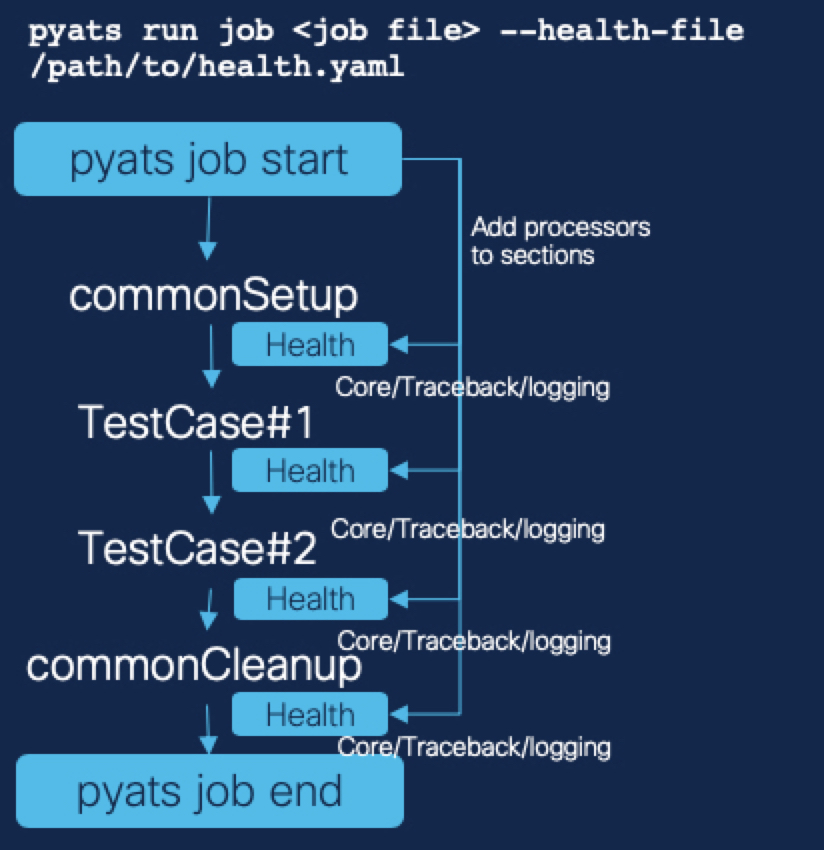
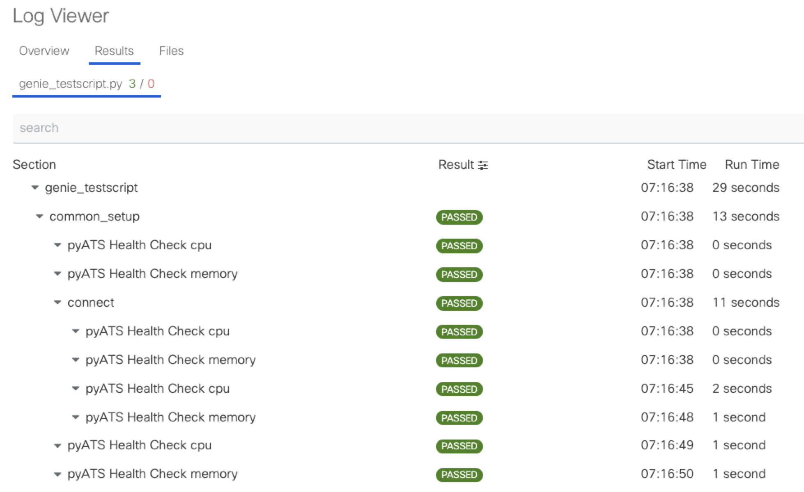

.. _health:

pyATS Health Check
==================
Collect and monitor the state of your devices as your testscript is executing with pyATS Health Check. It can collect traceback, core files, etc. pyATS Health Check is all yaml driven and it is based on :ref:`Blitz<blitz>`. All Blitz functionalities are fully supported in health check.

The health check is driven by a `health_file` which is provided at run time. There is two different mechanism to run the checks:

1. Part of a pre/post processor of a section or testcase.
2. Part of another process continuously (Coming up in September).

pyATS Health Check leverages existing :ref:`Blitz<blitz>` style YAML format and use same format and capabilities what Blitz has.
The actions in pyATS Health Check yaml, those actions will be added to pyATS job's each section as pre/post processors. Pre, Post or both processors can be specified in the yaml.

.. note::

     See the detail of :ref:`Blitz<blitz>`

.. code-block:: bash

    # Quick start Guide!
    # ------------------
    # 1. Create the health yaml
    # 2. Add the arguments
    # 3. (Optional) Run it and hope no issue is found by the pyATS Health Check!

    # Integrated with pyATS jobs
    pyats run job <job file> --testbed-file /path/to/testbed.yaml --health-file /path/to/health.yaml

You can find examples in our `Github repo
<https://github.com/CiscoTestAutomation/examples/tree/master/health>`_. Any contributions for pyATS Health Check examples are encouraged!

.. note::

     Devices for pyATS Health Check need to be in testbed yaml for pyATS job

     The pyATS testbed object will be converted to Genie testbed object to have Genie functionalities.

--------

Create health.yaml with knowledge about pyATS Blitz and then just add argument `--health-file` with the file. pyATS Health Check will add Blitz actions as processors to sections in pyATS job. And pyATS Health Check processors will run before and after each section to monitor/collect device status and etc.

Even for development of health yaml, the health file makes developer's life easier. It's same format with Blitz format and the health file can run like Blitz as well. So, develop and test as Blitz first and just switch argument from `--trigger-datafile` to `--health-file` when health yaml is ready.

pyATS Health Check comes with default checks; however it is fully open-sourced! You can add your own checks to be executed at any time! Any features or functions to monitor, those can be contributed and developed as Blitz actions or APIs.

.. note::

     See all the available APIs for pyATS Health Check `Available Apis <https://pubhub.devnetcloud.com/media/genie-feature-browser/docs/#/apis>`_

--------

pyATS Health Check's added processors can be easily found in pyATS Logviewer or XPRESSO. The added processors has `pyATS Health Check` and also icons for both `Pre` and `Post`.

.. toctree::
   :maxdepth: 2

   health_design/design
   health_usage/usage
