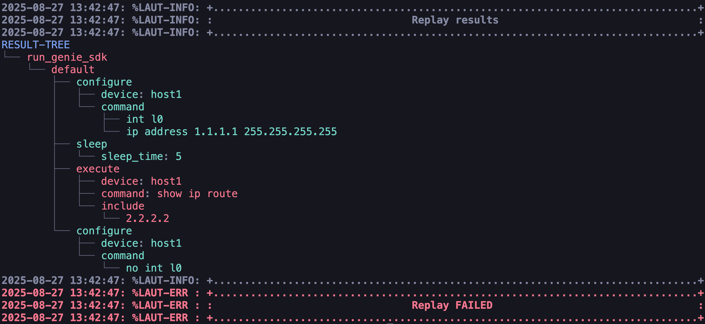

replay
======

The ``replay`` command executes LAMP-generated Blitz triggers
and automatically generates a pyATS Blitz 'run_genie_sdk' action
snippet.

Why replay
----------

Network automation frequently requires repeating identical 
tasks across multiple devices or environments. The replay 
command enables reusable test scenarios to be captured in 
Blitz trigger files and executed multiple times with a 
single command.

This modular approach improves efficiency by:

* Eliminating duplicate configuration steps
* Enabling consistent test execution  
* Creating reusable automation components
* Simplifying complex network workflows

The concept resembles functions in programming languages -
define once, execute many times.

Basic usage
-----------

The ``replay`` command executes LAMP-generated Blitz triggers 
from YAML files. The following example shows a Blitz trigger 
that performs route verification on 2 devices:

.. code-block:: yaml

    # route_verify.yaml
    # 27 August 2025
    # LAMP Generated testcase
    route_verify:
      source:
        pkg: genie.libs.sdk
        class: triggers.blitz.blitz.Blitz
      devices:
        - host1
      test_sections:
        - default:
            - execute:
                device: host1
                command: show ip route
                include:
                  - 1.1.1.1
            - execute:
                device: host2
                command: show ip route
                include:
                  - 1.1.1.1

This trigger can be auto-generated from LAMP and then 
used within other triggers as a sub-verification step. 
This approach avoids manually verifying the same thing 
across multiple trigger testcases.

To execute the trigger, use the ``replay`` command with 
the YAML file as an argument:

.. code-block:: console

    (lamp-host1) replay route_verify.yaml

The command executes each action in sequence and displays 
detailed output showing the progress and results of each step.

.. code-block:: console

    (lamp-host2) replay route_verify.yaml 
    2025-09-23 09:14:42: %LAMP-INFO: +..............................................................................+
    2025-09-23 09:14:42: %LAMP-INFO: :                       Starting action 'run_genie_sdk'                        :
    2025-09-23 09:14:42: %LAMP-INFO: +..............................................................................+
                                                                    route_verify: {}                               
    2025-09-23 09:14:42: %LAMP-INFO: +..............................................................................+
    2025-09-23 09:14:42: %LAMP-INFO: +..............................................................................+
    2025-09-23 09:14:42: %LAMP-INFO: :                          Starting section 'default'                          :
    2025-09-23 09:14:42: %LAMP-INFO: +..............................................................................+
    2025-09-23 09:14:42: %LAMP-INFO: +..............................................................................+
    2025-09-23 09:14:42: %LAMP-INFO: :                          Starting action 'execute'                           :
    2025-09-23 09:14:42: %LAMP-INFO: +..............................................................................+
                                                                  device: host1                                      
                                                                  command: show ip route                            
                                                                  include:                                          
                                                                    - 1.1.1.1                                       
    2025-09-23 09:14:42: %LAMP-INFO: +..............................................................................+

    2025-09-23 09:14:43,034: %UNICON-INFO: +++ host1 with via 'cli': executing command 'show ip route' +++
    show ip route
    Codes: L - local, C - connected, S - static, R - RIP, M - mobile, B - BGP
          D - EIGRP, EX - EIGRP external, O - OSPF, IA - OSPF inter area 
          N1 - OSPF NSSA external type 1, N2 - OSPF NSSA external type 2
          E1 - OSPF external type 1, E2 - OSPF external type 2, m - OMP
          n - NAT, Ni - NAT inside, No - NAT outside, Nd - NAT DIA
          i - IS-IS, su - IS-IS summary, L1 - IS-IS level-1, L2 - IS-IS level-2
          ia - IS-IS inter area, * - candidate default, U - per-user static route
          H - NHRP, G - NHRP registered, g - NHRP registration summary
          o - ODR, P - periodic downloaded static route, l - LISP
          a - application route
          + - replicated route, % - next hop override, p - overrides from PfR
          & - replicated local route overrides by connected

    Gateway of last resort is not set

          1.0.0.0/32 is subnetted, 1 subnets
    O        1.1.1.1 [110/11] via 10.0.0.1, 00:00:43, Ethernet0/0
          10.0.0.0/8 is variably subnetted, 2 subnets, 2 masks
    C        10.0.0.0/24 is directly connected, Ethernet0/0
    L        10.0.0.2/32 is directly connected, Ethernet0/0
    host1#
    2025-09-23 09:14:43: %LAMP-INFO: +..............................................................................+
    2025-09-23 09:14:43: %LAMP-INFO: :                          Validating INCLUDE Entries                          :
    2025-09-23 09:14:43: %LAMP-INFO: +..............................................................................+
    2025-09-23 09:14:43: %LAMP-INFO: :                               1.1.1.1 matches                                :
    2025-09-23 09:14:43: %LAMP-INFO: +..............................................................................+
    2025-09-23 09:14:43: %LAMP-INFO: +..............................................................................+
    2025-09-23 09:14:43: %LAMP-INFO: :                          Starting action 'execute'                           :
    2025-09-23 09:14:43: %LAMP-INFO: +..............................................................................+
                                                                  device: host2                                      
                                                                  command: show ip route                            
                                                                  include:                                          
                                                                    - 1.1.1.1                                       
    2025-09-23 09:14:43: %LAMP-INFO: +..............................................................................+

    2025-09-23 09:14:43,254: %UNICON-INFO: +++ host2 with via 'cli': executing command 'show ip route' +++
    show ip route
    Codes: L - local, C - connected, S - static, R - RIP, M - mobile, B - BGP
          D - EIGRP, EX - EIGRP external, O - OSPF, IA - OSPF inter area 
          N1 - OSPF NSSA external type 1, N2 - OSPF NSSA external type 2
          E1 - OSPF external type 1, E2 - OSPF external type 2, m - OMP
          n - NAT, Ni - NAT inside, No - NAT outside, Nd - NAT DIA
          i - IS-IS, su - IS-IS summary, L1 - IS-IS level-1, L2 - IS-IS level-2
          ia - IS-IS inter area, * - candidate default, U - per-user static route
          H - NHRP, G - NHRP registered, g - NHRP registration summary
          o - ODR, P - periodic downloaded static route, l - LISP
          a - application route
          + - replicated route, % - next hop override, p - overrides from PfR
          & - replicated local route overrides by connected

    Gateway of last resort is not set

          1.0.0.0/8 is variably subnetted, 2 subnets, 2 masks
    C        1.1.1.0/24 is directly connected, Loopback0
    L        1.1.1.1/32 is directly connected, Loopback0
          10.0.0.0/8 is variably subnetted, 2 subnets, 2 masks
    C        10.0.0.0/24 is directly connected, Ethernet0/0
    L        10.0.0.1/32 is directly connected, Ethernet0/0
    host2#
    2025-09-23 09:14:43: %LAMP-INFO: +..............................................................................+
    2025-09-23 09:14:43: %LAMP-INFO: :                          Validating INCLUDE Entries                          :
    2025-09-23 09:14:43: %LAMP-INFO: +..............................................................................+
    2025-09-23 09:14:43: %LAMP-INFO: :                               1.1.1.1 matches                                :
    2025-09-23 09:14:43: %LAMP-INFO: +..............................................................................+
    2025-09-23 09:14:43: %LAMP-INFO: +..............................................................................+
    2025-09-23 09:14:43: %LAMP-INFO: :                                Replay results                                :
    2025-09-23 09:14:43: %LAMP-INFO: +..............................................................................+
    RESULT-TREE
    └── run_genie_sdk
    2025-09-23 09:14:43: %LAMP-INFO: +..............................................................................+
    2025-09-23 09:14:43: %LAMP-INFO: +..............................................................................+
    2025-09-23 09:14:43: %LAMP-INFO: :                                Replay PASSED                                 :
    2025-09-23 09:14:43: %LAMP-INFO: +..............................................................................+
    (lamp-host2)  

The Blitz *'run_genie_sdk'* action snippet is automatically 
generated by LAMP after the execution as shown below:

.. code-block:: console

   (lamp-host1) list 1
    - run_genie_sdk:
        route_verify:
          devices:
            - host1
   (lamp-host1)

Extended triggers
~~~~~~~~~~~~~~~~~~~~

When saving a trigger that consists of other replayed 
triggers, all trigger file paths executed via ``replay`` 
command are automatically added to the Blitz *'extends'* 
field. This creates a dependency chain that ensures all 
required triggers are available when the saved trigger 
executes.

For example, if the 'route_verify' trigger is replayed 
for a trigger such as 'interface_flap' as shown below, 
the *'extends'* field of the 'interface_flap' trigger 
will contain the file path to the 'route_verify' trigger:

.. code-block:: yaml

    # interface_flap.yaml
    # 27 August 2025
    # LAMP Generated testcase
    extends:
      - route_verify.yaml
    interface_flap:
      source:
        pkg: genie.libs.sdk
        class: triggers.blitz.blitz.Blitz
      devices:
        - host1
      test_sections:
        - default:
            - execute:
                device: host1
                command:
                  - interface Ethernet0/0
                  - shutdown
                  - no shutdown
            - sleep:
                sleep_time: 10
            - run_genie_sdk:
                route_verify:
                  devices:
                    - host1

Run result
----------

After execution, LAMP displays a tree-like structure showing 
all actions and their results. This visual representation 
makes it easy to understand what happened during the test 
execution.

Result visualization features:

* **Passed actions**: Displayed in green text
* **Failed actions**: Displayed in red text  
* **Section folding**: Successful sections are collapsed to 
  focus attention on failures

The example below shows a test result with a failed 
'execute' action:

