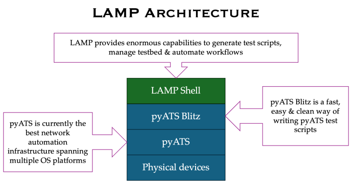
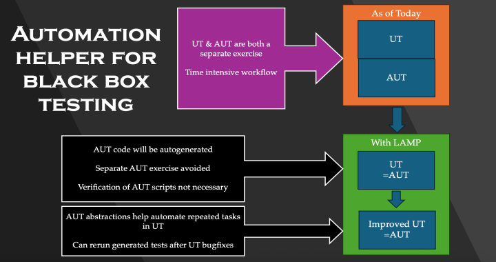

LAMP is an interactive command-line interface built on top of
pyATS/Genie that enables users to connect to network devices and perform operations interactively.
Think of it as a REPL (Read-Eval-Print Loop) for network automation—where you can execute commands,
parse outputs, run APIs, and configure devices in real-time, all while LAMP automatically records
your session into reusable Blitz YAML automation scripts.

**What LAMP Is**

LAMP provides an interactive shell that bridges the gap between manual device interaction and
automated testing. Instead of writing pyATS test scripts from scratch, you can work directly
with your devices through LAMP's intuitive command interface. Every action you perform is
automatically captured and can be replayed later, making it easy to convert exploratory work
into production-ready automation.

**Core Commands**

LAMP offers a comprehensive set of commands for device interaction:

- **execute** - Run CLI commands on devices and capture output
- **parse** - Execute commands and parse output into structured data using Genie parsers
- **configure** - Apply configuration changes to devices
- **api** - Execute Genie APIs for higher-level operations
- **bash_console** - Interact with device bash/shell consoles
- **replay** - Re-run previously recorded LAMP sessions (via Blitz YAML files)
- **sleep** - Add delays between operations

**Key Features**

- **Interactive Shell Capabilities**: Command history, autocompletion, and inline editing for a smooth user experience
- **Automatic Recording**: Every operation is automatically saved as Blitz YAML, turning interactive sessions into reusable automation scripts
- **Replay Workflows**: Use the ``replay`` command to re-execute previously recorded sessions, enabling rapid iteration and higher-level workflow automation
- **Variables and Loops**: Support for parameterized commands, variables, and loops to work with multiple devices or configurations efficiently
- **Include/Exclude Filters**: Powerful filtering options for command outputs to focus on specific data

**Architecture**

**Who Should Use LAMP**

LAMP is designed for everyone involved in network automation:

- **Network Engineers**: Quickly explore device configurations and troubleshoot issues interactively, then convert your investigation into automated tests
- **Test Automation Engineers**: Develop and validate pyATS test scripts faster by prototyping in LAMP before formalizing into test suites
- **DevOps Teams**: Build higher-level network workflows using LAMP's replay capability to chain operations and create automation pipelines
- **Beginners to pyATS**: Learn pyATS/Genie concepts interactively without needing to write Python code upfront

**Usage Context**

LAMP excels in scenarios where you need to:

- **Develop Automation Scripts**: Interactively build and test device operations, then export them as Blitz YAML for use in your automation framework
- **Create Reusable Workflows**: Record common operational sequences once, then replay them across different devices or environments
- **Prototype and Debug**: Experiment with device commands and APIs in real-time to understand behavior before committing to automation scripts
- **Higher-Level Orchestration**: Chain multiple LAMP sessions together using the ``replay`` command to build complex, multi-step workflows

**How It Works**

LAMP leverages pyATS Blitz YAML as its foundation, recording each operation you perform on network devices.
These recorded sessions become flexible, function-like building blocks that support parameters, variables,
and conditional logic. You can modify the generated YAML files to add validations, error handling, or
additional operations, then replay them as needed—making LAMP both a learning tool and a production-ready
automation platform.