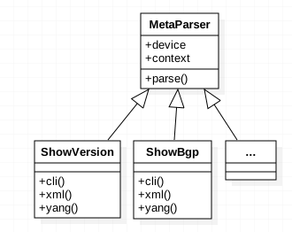

.. _advanced_usage:

Advanced Usage
==============

MetaParser is the base class for all back-end parser objects. It is available 
in ``genie.metaparser`` package. MetaParser does not enforce the back-end parsing 
machineries, but provides a mechanism to ensure whatever the back-end parser is 
(cli, xml, yang), the front-end to the script is always the same.It offers a 
simple and straight-forward way for users to define, execute and debug subclass 
parser objects. 

All subclass parsers (e.g.: `ShowVersion`) are inherited from MetaParser class. 
Each parser contains three parsing methods (cli(), xml(), yang()) to handle the 
specific parsing functionality. Subclass parsers follow community-driven development 
model contributing to Cisco `parser` package.

MetaParser class instance arguments
-----------------------------------
- **device**: device object which the parser function will be applied to.

- **context**: a keyword-only argument, acting as a string format selector for 
  user to choose which parsing mechanism will be used to current parsing task. 
  Choices of: 'cli', 'xml', 'yang', default value is 'cli'.
- **kwargs**: argument dictionary provides the user ability to assign extra 
  attributes while instantiating the parser object.

Example to instantiate MetaParser object:

.. code-block:: python
    
    # Assume subclass parser ShowVersion is inherits from MetaParser
    
    from genie.libs.parser.iosxe.show_platform import ShowVersion

    parser = ShowVersion(device=uut, context='yang')

MetaParser class variables
--------------------------
* **key_traceable**: enable the parser output key usage tracing functionality.
  Visit :ref:`MetaParser_Key_Usage_Traceability` section for details on this
  feature.

* **CONTEXT_LIST** - static variable defines valid contexts. Default value:
  ``('cli', 'xml', 'yang')``

* **schema** - defines the common data structure among all types of device 
  output (cli, xml, yang) the current parser class supports. Each parsing 
  mechanism implemented in a same parser class has to follow the same `schema` 
  definition to ensure that any management type (cli, xml, yang) used, will 
  return the same results to the calling script". For detail info about 
  `schema`, please visit :ref:`schemaengine_doc`.
  
  In ``MetaParser`` base class, default value of `schema` is `None` to allow 
  subclass parser objects to overwrite. Here is an example:

.. code-block:: python

    # Example of schema (show version) - nested dict
    # ----------------------------------------------
    from genie.metaparser.util.schemaengine import Any
    
    schema = {'cmp': {
                        'module': {
                                 Any(): {
                                         'bios_compile_time': str,
                                         'bios_version': str,
                                         'image_compile_time': str,
                                         'image_version': str,
                                         'status': str},}},
              'hardware': {
                        'bootflash': str,
                        'chassis': str,
                        'cpu': str,
                        'device_name': str,
                        'memory': str,
                        'model': str,
                        'processor_board_id': str,
                        'slots': str,
                        Any(): Any(),},}

.. note ::

        Any() in schema acting like a wildcard character in text. Any() is used 
        to presenting the variable keys within the dictionary.

.. _MetaParser_Key_Usage_Traceability:

MetaParser Key Usage Traceability
---------------------------------
With majority of parsers the output of the show command is parsed into a data 
structure (array, keylist, dictionary, etc..) returned to the script. Scripts 
using the parsers may refer to one/more of the attributes/keys in that parser. 
There is no mechanism to track what keys are used by each script, making it 
difficult to change/enhance/optimize the parser if needed.

MetaParser key traceability feature, tracks every reference to the parser keys 
throughout the execution of the script. This feature allows parsers developers 
build accurate `schema` for the additional models (XML/CLI/YANG) based on tracked 
key usage from the existing one. Schema is the foundation for implementing 
various parsing mechanisms (cli, xml, yang) within a same parser object, or can 
be shared as a common structure to build a os/platform agnostic parser solution.

**Enable Key-usage Traceability** 

By default, global key usage traceability feature is disabled in metaparser. 
Feature can be enabled in two way:
    1. globally within the user script by enabling the *key_traceable* flag
    2. dynamically through pyATS  pre/post processing functions

Once feature is enabled, the parsing output data type is collected and available 
in :ref:`TraceableDict`.

Below example shows how to enable the key traceability and display the tracing 
information within the user's script. The method provides parser developers a 
easy quick way to get key usage output for debugging or diagnosing purposes:

.. code-block:: python

    # import related modules
    from genie.libs.parser.nxos.show_platform import ShowVersion
    from genie.metaparser import MetaParser
    
    # enable global wise the key-traceability
    MetaParser.key_traceable=True
    
    # create subclass parser object
    parser = ShowVersion(device=uut)
    
    # parsing the output
    # now all keys/nestedkeys within 'output' will be traced
    output = parser.parse()
    
    # accessing a key from the output
    output['hardware']['chassis']

    # display the key usage from the MetaParser class
    pprint.pprint(MetaParser.tracer)
    
    {'ShowVersion': {('hardware', 'chassis')}}

To avoid changing user script from run to run to enable and display the key 
usage tracing information, MetaParser also provides :pyats:`pyATS <http>`
pre/post processor functions to dynamically enable the traceability in script
`common_setup` section, and log the trace info in the `common_cleanup` section.
The example below shows three steps to achieve this:

.. sidebar:: Helpful Reading

    - :pyats:`pyATS <http>`

    * **Step1**: define the pre/post processor in pyats data yaml file.
    .. code-block:: python

        common_setup:
            processors:
                pre:
                    genie.metaparser.enable_key_usage_trace
        
        common_cleanup:
        
            processors:
                post:
                    genie.metaparser.log_key_usage_trace

    * **Step2** add the data yaml in script job file.
    
    .. code-block:: python

        data_file = os.path.join('path/to/your/data/file/data.yaml')
    
        run(testscript=testscript, uut_name=uut, datafile = data_file)

    * **Step3**: view the key usage report which will be logged into 
      `comon_cleanup` section of pyats logs.

    .. code-block:: text

        nostg-ott-lnx-3: : Running post-processor: 'log_key_usage_trace'
        nostg-ott-lnx-3: : +------------------------------------------------------------------------------+
        nostg-ott-lnx-3: : |                             Metaparser Key Usage                             |
        nostg-ott-lnx-3: : +------------------------------------------------------------------------------+

MetaParser Abstraction
----------------------

.. sidebar:: Mandatory Reading

    - :ref:`abstract <abstract>`

It is very easy to achieve the abstraction among MetaParser objects by 
leveraging the Genie extention package - ``genie.abstract``. This package allows 
sub-parser developers to declare the parser abstraction package, register 
'tokens' (os, series, type, etc) for the parser modules. Therefore, user scripts 
have no need to hard-coded the specific parser object imports. The correct 
parser modules will be dynamically loaded during the script run-time. 

    * **Step1**: declare the parser abstraction package.

    Include the below code in the parser package which you want to enable the 
    abstraction. In our case, the location will be: 
    *parser/__init__.py*

    .. code-block:: python

        __import__('abstract').declare_package(__name__)
        

    * **Step2**: declare the token within the abstraction enabled package.
    
    Put the below one liner in the parser modules which you want to register 
    the abstraction token. In our case, the location will be: 
    *parser/nxos/__init__.py*, *parser/iosxr/__init__.py*,
    *parser/iosxe/__init__.py*, or any new types of platforms in the
    future.
    

    .. code-block:: python

        __import__('abstract'). declare_token(__name__)

    * **Step3**: use parser object in user script.
    
    .. code-block:: python

        import abstract
        
        # correct parser object lookup
        # uut.os will be learned via yaml file.
        parser = abstract.Lookup(uut.os)

        p = genie.libs.parser.parser.show_interface.ShowInterfaces(device=uut)
        output = p.parse()

For more detail abstraction info, refer cisco_shared :ref:`abstract <abstract>`
package.

MetaParser Usage Example
------------------------

Each parser object is imported into Python using the standard ``import`` 
mechanism, or use ``abstract`` package dynamic import function described in 
previous section. To run, simply call ``parse`` function.

Execution flow of the parse function:
    1.  Based on the "context" input (from job or from execution environment 
        args), a specific management model parsing 
        mechanism (cli/xml/yang) is called. The parsing mechanism defined in 
        subclass parser does the following:
            * Get the output from the device
            * Call back-end parsing API or run self implemented parser with the 
              output
            * Transform the output into 'schema' compatible dictionary
              and return. For detailed steps to implement parsing mechanism 
              refers to :ref:`template_doc`.

    2. Schema checking to ensure the returned data structure by the parsing 
       mechanism meets the schema requirement.

    3. Apply user defined filter on output, then only selected key-value pairs 
       will be returned as the original format from the output.

The following example shows the usage of the MetaParser with the abstraction (
typical scenario for pyats scripts):

.. code-block:: python

    # User Script Example
    # -------------------
    
    import abstract

    parser = abstract.Lookup(uut.os)
    p = genie.libs.parser.parser.show_version.ShowVersion(device=uut)
    
    # get the entire output
    output_all = p.parse()
    
    # Get the output only contains specific keys selected by users.
    # Note: all keys in list have to be exist. 
    # Here 'r' in front of the key string indicates the 'raw string literal' 
    # used as the Python regexp pattern.

    selected_keys = [['hardware', 'bootflash'], 
                     [r'.*', 'kickstart'], 
                     ['reason'],
                     [r'^kernel', r'.*']]
    output = p.parse(selected_keys = selected_keys)
    
    # output
    {'hardware': {'bootflash': '2048256'},
     'kernel_uptime': {'days': '113',
                       'hours': '2',
                       'minutes': '42',
                       'seconds': '5'},
     'reason': 'Unknown',
     'software': {'kickstart': 'version 6.2(6)',
                  'kickstart_compile_time': '12/5/2013',
                  'kickstart_image_file': 'bootflash:///kickstart.6.2.bin'}}

Below is an example to call MetaParser object without abstraction (applied when 
no abstraction needed or abstraction had been done in the upper caller layers, 
for example: Genie objects):

.. code-block:: python

    # User Script Example
    # -------------------
    from genie.libs.parser.nxos.show_platform import ShowVersion
    
    # instantiate parser object
    p = ShowVersion(device=uut)
    
    # get the entire output
    output_all = parser.parse()

MetaParser Fallback Mechanism
-----------------------------
- User can provide context in two forms:
    1. A string of the context. (EX: 'cli')
    2. A list of strings of contexts. (EX: ``['cli', 'yang', 'xml']``)

- Fallback mecahnism will only work when a list of contexts have been provided.

- The first item in the list is the main context and the subsequent ones
  are complemepantry. Means that if any key value in one of the subsequenet
  contexts is different than that of the main context, the key value of the
  main one will be the dominant one.

- ``Metaparser`` will parse using the first context in the list (
  in the above example 'cli'). If the parsed output is missing any mandatory
  schema key (not optional `schema` key), ``Metaparser`` will go fetch the
  missing keys (via `selected_keys`) using the following context in the list.

- Fallback mecahnism will only stop in two cases:
    1. All the missing `schema` keys have been successfully parsed.
    2. The context list last item has been reached.

- **context**: a keyword-only argument, acting as a string format selector for
  user to choose which parsing mechanism will be used to current parsing task.
  Choices of: 'cli', 'xml', 'yang', default value is 'cli'.
- **kwargs**: argument dictionary provides the user ability to assign extra
  attributes while instantiating the parser object.

Example to pass multiple contexts:

.. code-block:: python

        # Assume subclass parser ShowIpOspf inherits from MetaParser
        # Provide all the contexts available for that specific parser
        context=['cli','xml','yang']
        parser = ShowIpOspfSchema(device=uut, context=context)

        # Parsing will start with 'cli' then 'xml' and lastly 'yang' in case
        # 'cli' & 'xml' did not cover all the mnadatory schema keys.
        parsed_output = parser.parse()

MetaParser General Mechanism
----------------------------

- The following mechanism have been added to Metaparser to make it more effective.
  Users can provide static device output to the parser class via variable `output`.(This is useful for unitesting and reproducing failures)
  All show commands are supported `cli_command` or `xml_command` ,... as parser class variable.

  Summary:
    - Parsers now have support to directly parse static output provided to the parser class, without interacting with the device
    - All new parsers must contain class variable "cli_command" denoting the show command string and "xml_command" denoting the xml command string
    - All dynamic keys which are provided as kwargs in that parser must have the same name as the one in `cli_command`
    - A list can be provided in the `cli_command` if the parser parses multiple commands

Example to pass `output` and `cli_command`

.. code-block:: python

        class ShowIpPimRpMapping(ShowIpPimRpMappingSchema):

        # Passing cli_command as class variable and defining dynamic keys as {}
        # the dynamic key name must be the same as cli key name
        cli_command = ['show ip pim vrf {vrf} rp mapping', 'show ip pim rp mapping']

        # Passing output as cli key
        def cli(self, vrf='', output=None):
            if output is None:
                # set vrf infomation
                if vrf:
                    cmd = self.cli_command[0].format(vrf=vrf)
                else:
                    cmd = self.cli_command[1]
                out = self.device.execute(cmd)
            else:
                out = output

.. sectionauthor:: Ke Liu <kel2@cisco.com>,
                   Karim Mohamed <karmoham@cisco.com>,
                   Zahra Vakhideh <zvakhide@cisco.com>
