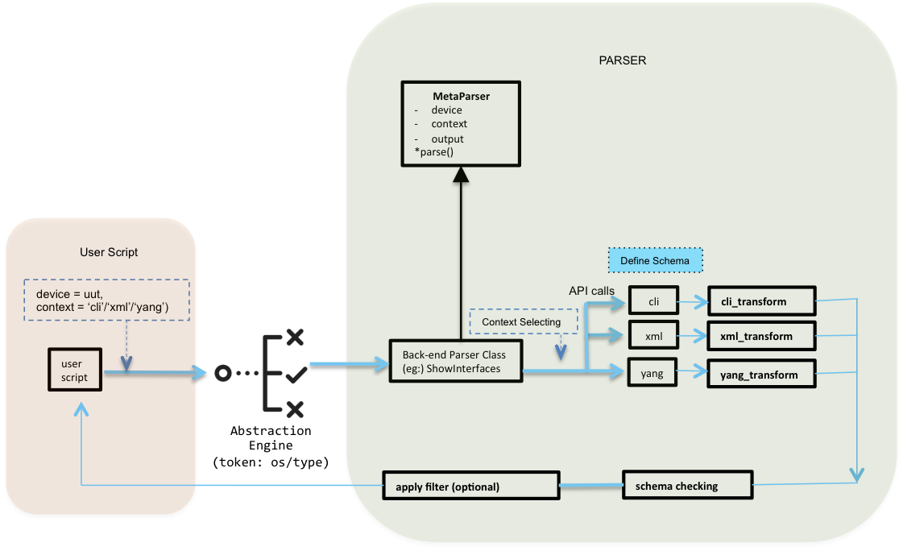

Introduction
============

In software engineering and computer science, `Parsing` is the mecahnism of
translating incomprehensible data to a script readable form. Parsers are the
root of automation, without them, automation could not
understand the device. There exists multiple ways to parse the device output,
with `different packages` with each their style.
There also exist multiple ways to communicate with the device (Cli, Xml, Rest,
Yang, etc.) with each providing `different structure` for the same information!

Metaparser role is to unify those packages, into one `location` and one
`structure`. A unified collection of parser, which works across multiple parser
packages, and across multiple communication protocols and still returns a
common structure. Metaparser allows to have one `script` which works across
multiple OS, multiple communication protocol and parsing packages.

Imagine an parsing infrastructure that:

- Promotes more easily maintainable platform/type/version agnostic testing 
  scripts by deferring operational data parsing to back-end libraries,
 
- Harmonizes parsing output among various interface categories, such as CLI, 
  XML and YANG
 
- Enforces only enough structure to give the script writer a consistent look 
  and feel across interface categories

- Is future proof, allowing a multitude of existing and yet-to-be-imagined 
  parsing implementations to coexist in the backend
 
- Enables an elastic parsing ecosystem that is simple enough for the novice but 
  feature-rich enough for the power user
 
- Leverages the strength of the modern Python-3 language while still allowing 
  bridging/reuse of Cisco's vast store of legacy TCL-based parsers.
 
 

Example 
=======

.. figure:: Metaparser.png
    :align: center

First, Import ``Metaparser`` as illustrated in the below example so it can be
used for inheritance for different schema classes. Metaparser schemaengine
provides various functionalities for the use within the schema structure as
explained in details here :schemaengine:`schema engine documentation <http>`.

.. sidebar:: Helpful Reading

    - :classtutorial:`Class Tutorial <http>`
    - :inheritancetutorial:`Inheritance Tutorial <http>`

In the below example, we are building a parser for three different show commands
using different contexts CLI, Yang and XML. The contexts' implementations are
following the same schema/structure so making the parser more rigid to any
change which will consequently provide stable/strong test scripts. Different
parsing mechanisms (Regex, :ref:`parsergen <parsergen>`, TextFSM, etc.) can be used withing the
parser as shown below.

.. note::

    Below example is not a complete one and it was just used for
    illustration purpose.

    Tons of parsers are already built and can be reached in :parsers:`parsers <http>`;

    Can't find a parser and want to build one?
    Visit :ref:`contribute_to_parser_build` section for detailed_steps.

.. code-block:: python

	Example 1
	---------
	# Metaparser
	from genie.metaparser import MetaParser
	from genie.metaparser.util.schemaengine import Schema, Any, Optional

	# ==============================================================================
	# Schema for:
	# * 'show bgp vrf <vrf> <address_family>  policy statistics redistribute
	# * 'show bgp vrf <vrf> <address_family>  policy statistics dampening'
	# * 'show bgp vrf <vrf> <address_family>  policy statistics neighbor <neighbor>'
	# ==============================================================================
	class ShowBgpPolicyStatisticsSchema(MetaParser):

	    schema = {
	        'vrf': {
	            Any(): {
	                Optional('rpm_handle_count'): int,
	                Optional('route_map'): {
	                    Any():{
	                        Any(): {
	                            'action': str,
	                            'seq_num': int,
	                            'total_accept_count': int,
	                            'total_reject_count': int,
	                            Optional('command'): {
	                                'compare_count': int,
	                                'match_count': int,
	                                'command': str
	                            }
	                        },
	                    },
	                }
	            },
	        }
	    }

	class ShowBgpPolicyStatistics(ShowBgpPolicyStatisticsSchema):
	    """Parser for:
	        show bgp [vrf <vrf>] <address_family>  policy statistics redistribute
	        show bgp [vrf <vrf>] <address_family>  policy statistics dampening
	        show bgp [vrf <vrf>] <address_family>  policy statistics neighbor <neighbor>
	        parser class implements detail parsing mechanisms for cli,xml 
	        and yang output"""
	    
	    def cli(self, cmd):

	        out = self.device.execute(cmd)
	        
	        # Init vars
	        ret_dict = {}
	        index = 1

	        # extract vrf info if specified,
	        # if not, vrf is default
	        m = re.compile(r'^show +bgp +vrf +(?P<vrf>\S+)').match(cmd)
	        if m:
	            vrf = m.groupdict()['vrf']
	            if vrf == 'all':
	                vrf = ''
	        else:
	            vrf = 'default'

	        for line in out.splitlines():
	            line = line.strip()

	            # Details for VRF default
	            p1 = re.compile(r'^Details +for +VRF +'
	                             '(?P<vrf>[\w\-]+)$')
	            m = p1.match(line)
	            if m:
	                vrf = m.groupdict()['vrf']
	                nei_flag = True
	                continue

	            # No such neighbor
	            if re.compile(r'No +such +neighbor$').match(line):
	                nei_flag = False

	            # Total count for redistribute rpm handles: 1
	            # Total count for neighbor rpm handles: 1
	            # Total count for dampening rpm handles: 1
	            p2 = re.compile(r'^Total +count +for +(?P<type>\w+) +rpm +handles: +'
	                             '(?P<handles>\d+)$')
	            m = p2.match(line)

	            # BGP policy statistics not available
	            p3 = re.compile(r'^BGP +policy +statistics +not +available$')
	            m1 = p3.match(line)

	            if m or m1:
	                if 'vrf' not in ret_dict:
	                    ret_dict['vrf'] = {}

	                if vrf not in ret_dict['vrf']:
	                    ret_dict['vrf'][vrf] = {}

	                ret_dict['vrf'][vrf]['rpm_handle_count'] = \
	                    int(m.groupdict()['handles']) if m else 0
	                continue

	            # C: No. of comparisions, M: No. of matches

	                ..... Parser continued .......

	        return ret_dict

	    def xml(self, cmd):
	        out = self.device.execute('{} | xml'.format(cmd))

	        etree_dict = {}
	        neighbor = None
	        # Remove junk characters returned by the device
	        out = out.replace("]]>]]>", "")
	        root = ET.fromstring(out)

	        # top table root
	        show_root = Common.retrieve_xml_child(root=root, key='show')
	        # get xml namespace
	        # {http://www.cisco.com/nxos:7.0.3.I7.1.:bgp}
	        try:
	            m = re.compile(r'(?P<name>\{[\S]+\})').match(show_root.tag)
	            namespace = m.groupdict()['name']
	        except Exception:
	            return etree_dict

	        # compare cli command
	        Common.compose_compare_command(root=root, namespace=namespace,
	                                       expect_command=cmd)

	        # get neighbor
	        nei = Common.retrieve_xml_child(root=root, key='__XML__PARAM__neighbor-id')

	        if hasattr(nei, 'tag'):
	            for item in nei.getchildren():
	                if '__XML__value' in item.tag:
	                    neighbor = item.text
	                    continue

	                # cover the senario that __readonly__ may be mssing when
	                # there are values in the output
	                if '__readonly__' in item.tag:
	                    root = item.getchildren()[0]
	                else:
	                    root = item
	        else:
	            # top table rootl
	            root = Common.retrieve_xml_child(root=root, key='TABLE_vrf')

	        if not root:
	            return etree_dict

	        # -----   loop vrf  -----
	        for vrf_tree in root.findall('{}ROW_vrf'.format(namespace)):
	            # vrf
	            try:
	                vrf = vrf_tree.find('{}vrf-name-polstats'.format(namespace)).text
	            except Exception:
	                break

	                ..... Parser continued .......

	        return etree_dict

	    def yang(self):
	        """parsing mechanism: yang

	        Function yang() defines the yang type output parsing mechanism which
	        typically contains 3 steps: executing, transforming, returning
	        """

	        map_dict = {}
	        cmd = '''<native><interface><Vlan/></interface></native>'''
	        output = self.device.get(('subtree', cmd))

	        for data in output.data:
	            for native in data:
	                for interface in native:
	                    vlan_id = None
	                    interface_name = None
	                    ip_address = None
	                    ip_mask = None
	                    for vlan in interface:
	                        # Remove the namespace
	                        text = vlan.tag[vlan.tag.find('}')+1:]
	                        #ydk.models.ned_edison.ned.Native.Interface.Vlan.name
	                        #ydk.models.xe_recent_edison.Cisco_IOS_XE_native.Native.Interface.Vlan.name
	                        if text == 'name':
	                            vlan_id = vlan.text
	                            interface_name = 'Vlan' + str(vlan_id)
	                            continue

	                ..... Parser continued .......

	        # Return to caller
	        return map_dict

	Example 2 (Using Parsergen parsing Mechanism)
	---------------------------------------------
	# Import parsergen package
	import parsergen

	# Build Schema
	class ShowIpInterfaceBriefSchema(MetaParser):
	    """Parser for show ip interface brief"""
	    schema = {'interface':
	                {Any():
	                    {Optional('vlan_id'):
	                        {Optional(Any()):
	                                {'ip_address': str,
	                                 Optional('interface_is_ok'): str,
	                                 Optional('method'): str,
	                                 Optional('status'): str,
	                                 Optional('protocol'): str}
	                        },
	                     Optional('ip_address'): str,
	                     Optional('interface_is_ok'): str,
	                     Optional('method'): str,
	                     Optional('status'): str,
	                     Optional('protocol'): str}
	                },
	            }

	# Build Parser
	class ShowIpInterfaceBrief(ShowIpInterfaceBriefSchema):
	    """Parser for:
	     show ip interface brief
	     parser class implements detail parsing mechanisms for cli and yang output.
	    """
	    #*************************
	    # schema - class variable
	    #
	    # Purpose is to make sure the parser always return the output
	    # (nested dict) that has the same data structure across all supported
	    # parsing mechanisms (cli(), yang(), xml()).

	    def __init__ (self, *args, **kwargs):
	        super().__init__(*args, **kwargs)
	        self.cmd = 'show ip interface brief'.format()

	    def cli(self):
	        """parsing mechanism: cli

	        Function cli() defines the cli type output parsing mechanism which
	        typically contains 3 steps: exe
	        cuting, transforming, returning
	        """
	        parsed_dict = {}
	        output = self.device.execute(self.cmd)

	        if output:
	            res = parsergen.oper_fill_tabular(device_output=output,
	                                              device_os='iosxe',
	                                              table_terminal_pattern=r"^\n",
	                                              header_fields=
	                                               [ "Interface",
	                                                 "IP-Address",
	                                                 "OK\?",
	                                                 "Method",
	                                                 "Status",
	                                                 "Protocol" ],
	                                              label_fields=
	                                               [ "Interface",
	                                                 "ip_address",
	                                                 "interface_is_ok",
	                                                 "method",
	                                                 "status",
	                                                 "protocol" ],
	                                              index=[0])

	            # Building the schema out o fthe parsergen output
	            if res.entries:
	                for intf in res.entries:
	                    del res.entries[intf]['Interface']

	                parsed_dict['interface'] = res.entries
	        return (parsed_dict)

	    def yang(self):
	        """ parsing mechanism: yang

	        Function yang() defines the yang type output parsing mechanism which
	        typically contains 3 steps: executing, transforming, returning
	        """
	        pass

	    def yang_cli(self):
	        cli_output = self.cli()
	        yang_output = self.yang()
	        merged_output = _merge_dict(yang_output,cli_output)
	        return merged_output

.. note::

    For package advanced usage, you can refer to :ref:`advanced_usage` section.

