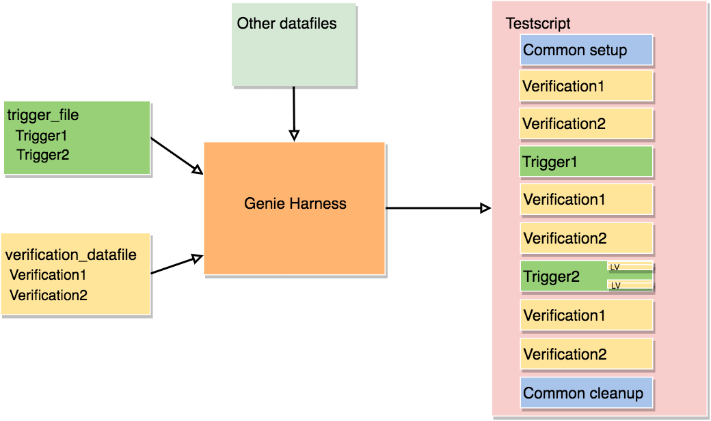
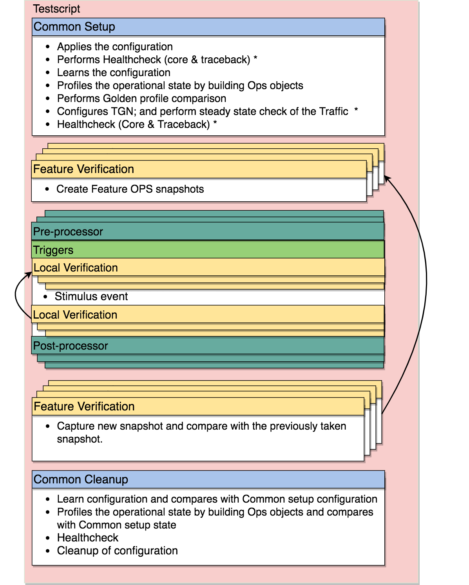

.. _tech_design:

Fundamental
===========

Let's start with some short questions and answers:

**What are the most common test scenarios in test automation?**

  Triggers and verifications are the most common test scenarios in
  test automation.

   * Triggers: Triggers support multiple actions. HA, restart, reload,
     config/unconfig, enable/disable, connect/disconnect and clear are some of
     the most common trigger.

   * Verifications: Verifications check whether the software or the feature is
     performing as expected.

**What types of testing levels exist?**

  Unit Test, Sanity (smoke, commit, nightly), Integration, Component/Regression,
  System/Solution are some examples of the different testing levels that exist.
  The depth of coverage, the topology, runtime, and the scale of the requirements
  all vary, depending on the testing level.

**How can Genie help teams with test automation ?**

  Unlike traditional test automation, which are written very monolithically,
  ``Genie`` uses microservice design and development principles. This software
  is ideal for cross OS/Platform teams. It enables them to develop in parallel,
  conduct tests, and scale their respective feature/components independently.

  ``Genie`` eliminates infrastructure development and focuses on developing
  modular and independent test and libraries.  It decouples the tests from
  topology/configuration to address a large array of user requirements in
  UT/Sanity/Regression/Solution and AS.

  ``Genie`` Conf, ``Genie`` Ops, and ``Genie`` `SDK` encourage teams to write
  loosely coupled tests that can be easily maintained, understood, and reused.

  ``Genie`` `SDK` provides the baseclass for most common test scenarios.

  ``Genie`` `Harness` mixes various tests and runs them under various test
  conditions, thereby providing flexibility to scale coverage, configuration,
  and runtime  based on the requirements of the particular testing level.

.. note::

  ``Genie`` uses pyATS :ref:`abstraction <abstract>` to support various abstraction
  requirement at feature levels, OS/Platform/Release/CLI/YANG/REST/ , etc..
  Users are encouraged to understand and use abstraction in their libraries and
  scripts to reduce conditional `if` statements based on hardcode variables.

Configuration
-------------

The following are ``Genie``'s core elements for the `conf` objects:

 - `Feature`
 - `Testbed`
 - `Device`
 - `Interface`
 - `Link`

`Feature` is the baseclass for the specific configuration to be applied to the
topology. `Testbed`, `Device`, `Interface`, and `Link` are the baseclasses
that define the topology.

* `Feature`: This baseclass represents the feature to be configured on the
  device/interface/link.

.. note::

  For more details refer  to :ref:`Feature object <new_feature>`.

* `Testbed`: This baseclass defines the base topology. It contains `Device` and `Link`
  objects. The testbed also provides APIs/methods to i) find particular objects with
  matching criteria; and ii) add or remove a `Device` and/or `Link`.  When a `Testbed` object is
  configured, everything contained in the object will be configured (the
  `Device` and `Link` objects).

.. note::

  For more details refer to :ref:`Testbed object <testbed>`.

* `Device`: This baseclass provides APIs to find: i) the `Interface`/`Features` matching criteria; and ii)
  add/remove `Interface`/`Feature`.

.. note::

  For more details refer to :ref:`Device object <device>`.

* `Interface`: This baseclass represents an interface on a given `Device`.

.. note::

  For more details refer to :ref:`Interface object <interface>`

* `Link`: This baseclass represents one-to-many connections to an `Interface`.
  `Link` object provides APIs to add, remove, or find an `Interface`.

.. note::

  For more details refer  to :ref:`Link object <link>`.

The diagram below depicts the object relationship. Refer to the :ref:`uml` for more information.

.. figure:: design.png
    :align: center
    :alt: New feature

    The orange lines represent which object contains what other
    objects. The green dashed lines shows which object may access another
    object, without containing it.

Operation
---------

The ``Genie`` `ops` object takes a `snapshot` of a `Feature` on a `Device`. The
`snapshot` captures operation data about the `Feature` by issuing
multiple commands to the `Device` in parallel. Various `snapshot` can be taken at
various stages of execution and used to compare/verify the feature's stability.

``Genie`` uses :connectionpool:`pyATS connection pool <http>` for parallel execution of the commands.
It also uses :ref:`metaparser <metaparser>` to standardize the returned parser structure
independently of the backend parser, such as :ref:`parsergen <parsergen>`, textfsm, etc, and
interface management used, such as (CLI/YANG/REST). Metaparser also provides a
fall-back (CLI, XML, REST combination), which can be used in cases where not
all structure attributes are yet available.

.. note::

  Refer to :connectionpool:`pyATS connection pool <http>` for details on parallel connection.

.. note::

  Refer to :ref:`metaparser <metaparser>` for details on creating a generic parser structure.

.. note::

  Refer to :ref:`parsergen <parsergen>` for details on CLI Auto-Parser.

The diagram below illustrates a ``Genie`` `Ops` snapshot throughout execution
and comparison operation.

.. figure:: Genie_ops.png
    :align: center
    :alt: New feature

    Example workflow

SDK - Triggers & Verifications
------------------------------

``Genie`` `SDK` provides the baseclass for most common test scenarios and generic libraries.

`Trigger` is a `pyATS` testcase class capable of supporting multiple `test`
sections.  Trigger class, via inheritance, can customize test sections when,
and if needed, while keeping the main flow of the trigger intact.

`Trigger` SDKs are categorized into groups.  The baseclass trigger in each
group provides the structure and the flow. This facilitates variation of the
trigger to be written without having to make significant changes to the code
(Object oriented programming concepts 101! ). For example, all the Clear
triggers such as ClearRoutes, ClearBgpNeighbor are inherited from Clear base
trigger).***

.. note::

    Triggers can be found under:  `genie_libs/sdk/triggers/structure/`.

A `verification` takes a snapshot of a feature's data structure. Each time this
verification is rerun, the original snapshot is compared with the current
snapshot. As the verification progresses, we can determine whether the state of
the device has changed and whether it is performing as expected.

A `verification` can either be a `pyATS` test case or a `test` section of a
`Trigger`. When it is its own testcase, then we call it `global verification`.
When it is part of a trigger, we call it `local verification`.  `local
verification`'s snapshots are compared with the trigger and not with the
`global verifications`.

A `verification` can either be an `Ops` object, a `parser` object, or a
`callable` which returns a dictionary.

Harness
-------

``Genie`` `Harness` amalgamates all ``Genie`` components to automatically
generate a `pyATS` testscript based on datafiles. The flow of execution and the
test content are derived from the datafiles. The testcase and test content are
identified by select triggers and verifications in the `Genie` `SDK` library.

The picture below shows a typical flow of ``Genie`` `Harness` with details
about each section.

``Genie`` `Harness` uses pyATS :ref:`abstraction <abstract>` to dynamically load and associate
`Trigger` and `Verification` based on the devices' information.

Each trigger can have a set of pre and post-processor to extend the test or
validation, which can be added at runtime via the datafiles. This adds
functionality to the triggers without having to actually modify the triggers'
code.

``Genie`` `Harness` is highly customizable via the datafiles. Below are some of
the features controlled via the datafiles:

 * Execute a `trigger` or `verification` on different UUT. If many UUTs are
   provided, many new testcases will be created.

 * Each `trigger` and `verification` can be repeated as many times as desired.
   This is very useful for stress tests.

 * Each `trigger` and `verification` can be organized by execution groups.

 * Multiple configuration files can be applied on all devices via tftp. If
   a specific error messages is seen, the run will be terminated.

Another key feature of ``Genie`` `Harness` is it's `Profile The System`
feature, refered as: `PTS`. PTS allows ``Genie`` `Harness` to learn the
operational information/state of the features and to create a snapshot. 
This snapshot can then be used in different stages of the run to validate 
the state of the feature/system is as expected.

The PTS feature can as well be used to validate the actual applied configuration
right at the start.  A `golden` snapshot can be created which details the expected
configuration the system should be running with.  The `golden` snapshot can then 
be compared to the initial snapshot taken in the `common_setup` of the runs, any 
differences can then be tagged and action taken (ignore, warning, abort of the run).
