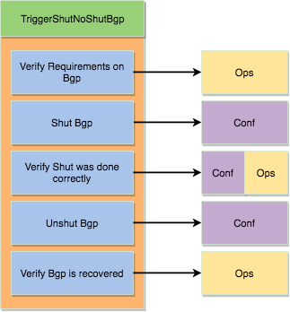

.. _harness_mapping:

Mapping
=======

Once a few triggers has been written, a pattern emerges. A lot of triggers
follow the same code flow.

1. Verify the trigger can be executed and gather some information
2. Do the action
3. Verify if the action has performed correctly
4. Revert configuration
5. Verify it is back to the initial state

Let's go over a few examples of triggers to see the pattern.

**ShutNoShut<feature>**

1. Verify that <feature> is configured and learn which one to shut
2. Shut the <feature>
3. Make sure it is shut.
4. Send a no shut.
5. Make sure it is back to original state.

**DisableEnable<feature>**

1. Verify that <feature> is configured.
2. Disable the <feature>
3. Make sure it is disabled.
4. Re-configure the <feature>
5. Make sure it is back to original state.

**UnconfigConfig<feature>**

1. Verify that <feature> is configured.
2. Unconfig the <feature>
3. Make sure it is unconfigured.
4. Re-configure the <feature>
5. Make sure it is back to original state.

`Mapping` is a class that allows to drive those kind triggers, without having
to write any new line of code. It utilizes `Conf` and `Ops` object to do the
action and learn about the feature. Each of these examples follow the structure from the :models:`Models <http>`.

.. notes::

    Mapping is optional when writing trigger. 

Below explains how `Mapping` tackles all these five steps:

1. Verify the trigger can be executed and gather some information
2. Do the action
3. Verify if the action has performed correctly
4. Revert configuration
5. Verify it is back to the initial state

**1. Verify the trigger can be executed and gather some information and 
5. Verify it is back to the initial state**

.. code-block:: python

    Mapping(requirements={'genie.libs.ops.bgp.bgp.Bgp':{
                                           'requirements':[['info', 'instance', '(?P<instance>.*)',
                                                            'vrf', '(?P<vrf>.*)', 'neighbor',
                                                            '(?P<neighbor>.*)', '(?P<neighbor_info>.*)']],
                                         'exclude': [''keepalives', 'total']}})

This requirements mentions:

    * Learn `Ops Bgp` feature 
    * Learn all the instances, vrfs, neighbors and the neighbor information.
      These can be made by modifying the regex.

In the case that it cannot learn this requirement, then the trigger will be
skipped. For example, there is no instance which contains a vrf which has a
neighbor.

At the end of the trigger, step 5, the initial requirements will have their
structured outputs compared, and only pass if all the keys are the same, except
the `exclude` ones.

.. note::

    5. Verify it is back to the initial state

.. note::

     The learnt information is then used in other section of the trigger.

.. note::

    Multiple `Ops/Conf` object can be learn by adding more element to the
    dictionary.

.. note::

    Multiple requirements of a `Ops/Conf` can be learn by adding more element to
    the list.

**2. Do the action**

.. code-block:: python

    Mapping(config_info={'genie.libs.conf.bgp.Bgp':{
                         'requirements':[['device_attr', '{uut}',
                                          'protocol_shutdown', True]],
                         'verify_conf':False,
                         'kwargs':{'mandatory':{'bgp_id': [['info', 'instance', '(?P<instance>.*)',
                                               'bgp_id', '(?P<bgp_id>.*)']]}}}},

In a lot of cases, an action is a change of configuration on the device. This
configuration is driven with the `Conf` object attributes.

The `requirements` mention which attributes to modify and which value to put.
The structures follow the ``Genie`` `Conf` :models:`models <http>`.

In the above example, the following happens:

.. code-block:: python

    from genie.libs.conf.bgp import Bgp
    for instance in <instance learnt>:
        bgp = Bgp(bgp_id = <bgp_id coresponding to this instance>)
        uut.add_feature(bgp)

        bgp.device_attr[testbed.devices['uut']].protocol_shutdown = True
        # This will abstract based on the device type
        bgp.build_config()

.. note::

   Multiple `Conf` object can be configured by adding more element to the
   dictionary.

.. note::

   `kwargs` is not mandatory, but provides kwargs for the initialiation of
   the `Conf` object.

.. note::

    `{uut}` represent the uut for this particular trigger.

**3. Verify if the action has performed correctly**

.. code-block:: python

    Mapping(verify_ops={'genie.libs.ops.bgp.bgp.Bgp':{
              'requirements': [['info', 'instance', '(?P<instance>.*)', 'protocol_state',
                                'shutdown'],
                               ['info', 'instance', '(?P<instance>.*)', 'vrf',
                                '(?P<vrf>.*)', 'neighbor',
                                '(?P<neighbor>.*)', 'session_state',
                                'shut (admin)'],
                               ['info', 'instance', '(?P<instance>.*)', 'vrf',
                                '(?P<vrf>.*)', 'neighbor',
                                '(?P<neighbor>.*)', 'shutdown',
                                True]],
              'kwargs':{'attributes':['info']},
              'exclude': ['keepalives', 'total']}})

To verify if the action performed correctly, `Conf` and `Ops` object can be
used by mentioning the modified variable modified with their coresponding
values. Every other variables is then compared with the initial snapshot taken
at step 1. The `exclude` key can be used to mention which variable not to
compare.

In the above example the following happens:

.. code-block:: python

    from genie.libs import ops
    from genie.abstract import Lookup
    lookup = Lookup.from_device(uut)
  
    bgp = lookup.ops.bgp.bgp.Bgp()
    bgp = Bgp(uut)
    bgp.learn()

    # For each requirements, verify the value is as expected
    assert bgp.info['instance'][<for all instances learnt>]['protocol_state'] == shutdown
    assert bgp.info['instance'][<for all instances learnt>]['vrf'][<for all vrf learnt>]['neighbor'][<for all neighbor>['session_state']  == 'shut (admin)'
    ...

    # Diff all the other keys, but do not compare the keys which were compared
    diff = Diff(snapshot_taken_in_step1, bgp, exclude=<previous keys>)
    if diff:
       self.failed(diff)

.. note::

    Multiple `Ops/Conf` object can be used to verify by adding more element to
    the dictionary.

.. note::

    Multiple requirements of a `Ops/Conf` can be verified by adding more
    element to the list.

**4. Re-configure the <feature>**

This section either replies the configuration or re-applies it with
tftp/rollback functionality.

It is done automatically with `Mapping`.

**5. Verify it is back to the initial state**

It is expected that after each trigger, the state of the topology returns to
the initial state, except the excluded keys defined in the `requirements`
section. In this section, a new snapshot is taken and compared with the initial
one from the begining of the trigger.

The following happens:

.. code-block:: python

    from genie.libs import ops
    from genie.abstract import Lookup
    lookup = Lookup.from_device(uut)
  
    bgp = lookup.ops.bgp.bgp.Bgp()
    bgp = Bgp(uut)
    bgp.learn()

    diff = Diff(snapshot_taken_in_step1, bgp, exclude=exclude)
    if diff:
       self.failed(diff)

Put all these sections together, we get this mapping:

.. code-block:: python

    from genie.harness.base import Trigger
    from genie.libs.sdk.libs.utils.mapping import Mapping

    class TriggerShutNoShutBgp(Trigger):
        '''Shut Bgp protocol'''
    
        mapping = Mapping(requirements={'ops.bgp.bgp.Bgp':{
                                              'requirements':[['info', 'instance', '(?P<instance>.*)', 'vrf',
                                                               '(?P<vrf>.*)', 'neighbor',
                                                               '(?P<neighbor>.*)', '(?P<neigh_info>.*)']],
                                            'kwargs':{'attributes':['info']},
                                            'exclude': [''keepalives', 'total']}},
                          config_info={'conf.bgp.Bgp':{
                                         'requirements':[['device_attr', '{uut}',
                                                          'protocol_shutdown', True]],
                                         'verify_conf':False,
                                         'kwargs':{'mandatory':{'bgp_id': [['info', 'instance', '(?P<instance>.*)',
                                                               'bgp_id', '(?P<bgp_id>.*)']]}}}},
                          verify_ops={'ops.bgp.bgp.Bgp':{
                                        'requirements': [['info', 'instance', '(?P<instance>.*)', 'protocol_state',
                                                          'shutdown'],
                                                         ['info', 'instance', '(?P<instance>.*)', 'vrf',
                                                          '(?P<vrf>.*)', 'neighbor',
                                                          '(?P<neighbor>.*)', 'session_state',
                                                          'shut (admin)'],
                                                         ['info', 'instance', '(?P<instance>.*)', 'vrf',
                                                          '(?P<vrf>.*)', 'neighbor',
                                                          '(?P<neighbor>.*)', 'shutdown',
                                                          True]],
                                        'kwargs':{'attributes':['info']},
                                        'exclude': [''keepalives', 'total']}},
                          num_values={'instance':'all', 'vrf':'all', 'neighbor':'all'})

This ties it all together. Creating a trigger without any code, but re-using
libraries. One field was added, `num_values`. It allows to mention how many of
each regex element to learn. `all` means to learn everything, though we could
have written:

.. code-block:: python

    num_values={'instance':1, 'vrf':'all', 'neighbor':'all'})

Then it would have only learnt the first instance it has seen and do the
trigger only on this instance.

This file contains the information about the trigger, an should not be modified
frequently. Argument which should be modified often, should be done with the
`trigger_datafile`.

.. code-block:: text

    TriggerShutNoShutBgp:
        source:
          pkg: genie.libs.sdk
          class: triggers.shutnoshut.bgp.shutnoshut.TriggerShutNoShutBgp
        groups: ['shut-noshut', 'bgp', 'L3']
        method: 'tftp'  # Could be either tftp or checkpoint
        timeout:
           max_time: 300
           interval: 15
        devices:
          uut:
            None

Each trigger using `Mapping` contains `Timeout` functionality. The timeout
allows a grace period before marking a section as failed. It will loop until
the `max_time` runs out with specific interval. The above example mention to
run for a maximum of `300 seconds`, and try every `15 seconds`.

`Mapping` currently supports the following kind of triggers: ShutNoShut,
UnconfigConfig, DisableEnable, Modify, AddRemove.

Using FileTransferUtils
