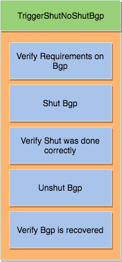

.. _harness_trigger:

Triggers
========

A trigger is a set of actions and verifications that, together, constitute a
testcase. These actions can include removal/addition of configuration, flapping
protocols/interfaces, perform HA events, and any other actions that a user may want to
perform to test his/her device. Triggers can also include verifications that
check whether or not the actions were performed correctly on the devices. We call these
verifications, `local verifications`.

Your First Trigger
------------------

The idea of writing a `Trigger` is quite simple. The process is very similar to the
process users rely on to write a testcase in `pyATS`  that performs an action on a device.
It goes something like this:

* Check the device has the configuration for the action.
* Perform the action.
* Verify the expected result on the device.
* Undo the action (If the device state was changed).
* Verify the expected result on the device.

Let's use an example to illustrate this further. Let's shut and unshut an
interface:

* Find an interface which is `up`.
* Shutdown this interface.
* Verify the interface is `down`.
* Unshut this interface.
* Verify the interface is `up`.

Let's convert that to code now:

.. code-block:: python

    from pyats import aetest

    # Genie import
    from genie.harness.base import Trigger

    # Parser import
    from genie.libs.parser.show_interface.iosxe.show_interface import ShowIpInterfaceBrief

    # Import Genie Conf
    from genie.libs.conf.interface import Interface

    class ShutNoShutInterface(Trigger):

        @aetest.test
        def learn_interface(self, uut):
            self.parser = ShowIpInterfaceBrief(uut)
            out = self.parser.parse()

            # let's find an interface which is up
            for interface, value in out.items():
                if value['Status'] == 'Up':
                    # found an interface which is up
                    interface = interface
                    break
            else:
                # Could not find an interface
                self.skipped("Could not find an interface "
                             "for device '{u}'".format(u=uut.name),
                             goto=['next_tc'])

            # Create a Genie conf object out of it
            # This way, it will be OS/Cli/Yang Agnostic
            self.intf1 = Interface(name=interface, device=uut)

        @aetest.test
        def shut(self):
            # Call Genie Conf
            self.intf1.shutdown = True
            self.intf1.build_config()

        @aetest.test
        def verify_shut(self, uut):
            parser = ShowIpInterfaceBrief(uut)
            parser.parse()

            # Verify if the interface is down
            assert(parser[self.interface]['Status'] == 'Down')

        @aetest.test
        def noshut(self):
            # Call Genie Conf
            self.intf1.build_unconfig()

        @aetest.test
        def verify_noshut(self, uut):
            # Call Ops
            output = self.parser.parse()

            # Verify if the interface is back up
            assert(parser[self.interface]['Status'] == 'Up')

For more information on how to add and execute this `Trigger`, please refer
to the :ref:`user guide <getting_trigger>`.

Guidelines
----------

A trigger must inherit from `from genie.harness.base import Trigger`,
which itself inherits from the pyATS `Testcase`.

As you can see from the examples above, we have divided most actions into different subsections. By dividing
actions in this way, we facilitate inheritance. This means that other engineers can inherit
this `Trigger` and easily add a new test section or modify an existing `Trigger`.
When designing `Triggers`, please follow good OOP design.

More guideline can also be found on the :geniewiki:`wiki <http>`.

Using Processors
----------------

``Genie`` triggers are fully customizable with the help of pyats
pre/post/exception :processors:`Processors <http>` and :ref:`abstraction <abstract>`.

Step 0: You got a processor? Great, that is all you need! If you don't have a
processor, simply write a new pre/post/exception :processors:`Processors <http>`.

.. note::

    Please ensure newly created processors have met the requirements outlined at
    :processors:`Processors <http>`.

Step 1: Add your processors information to the `trigger_datafile` as
shown below.

.. code-block:: yaml

    <trigger name>:
        source:
            pkg: genie.libs.sdk
            class: <your location, for example: sdk.triggers.clear.bgp.clear.TriggerClearBgpAll>
        devices: ['uut']
        processors:
            pre:
                order: [<processor name>, <processor_name>, ..]  # optional processor order
                <your pre processor name>:
                    pkg: <your abstraction package, for example: genie.libs.sdk>
                    method: <your location, for example: sdk.libs.prepostprocessor.sleep_processor>
                    parameters:
                        <your parameters variable name>: <your parameters value>
            post:
                order: [<processor name>, <processor_name>, ..]  # optional processor order
                <your post processor name>:
                    pkg: <your abstraction package, for example: genie.libs.sdk>
                    method: <your location, for example: sdk.libs.prepostprocessor.sleep_processor>
                    parameters:
                        <your parameters variable name>: <your parameters value>
            exception:
                order: [<processor name>, <processor_name>, ..]  # optional processor order
                <your exception processor name>:
                    pkg: <your abstraction package, for example: genie.libs.sdk>
                    method: <your location, for example: sdk.libs.prepostprocessor.sleep_processor>
                    parameters:
                        <your parameters variable name>: <your parameters value>

.. note::

    If needed, abstraction can be added via the `pkg` key.
    If needed, extra parameters can be added via the `parameters` key.

Step 3: Ensure the `job` file is pointing to this trigger file via
`trigger_datafile` argument.

Step 4: To execute your trigger, run your job via easypy with the required
arguments.

.. note::

    The only mandatory argument is the :ref:`testbed file <book_setup_testbed>`.

Step 5: You have a processor which you think should be part of ``Genie`` master
`trigger_datafile` ?  Feel free to send an email to `asg-genie-dev` for
review to add this processor to the ``Genie`` Master `trigger_datafile`.

Using FileTransferUtils
-----------------------

`pyATS` provides a useful package ``FileTransferUtils`` that can be used for
file copy operation to/from device as per :filetransferutils:`filetransferutils <http>` documentation.

It supports different transfer protocols like tftp, ftp, etc.

Examples can be found at :filetransferutils_examples:`filetransferutils_examples <http>`.

.. note::

    Genie already instantiates the `filetransfer` in CommonSetup section under
    configure section and store it under each device object. Then `filetransfer`
    object can be reused during the run whenever needed. If user didn't chose
    to run `configure` under CommonSetup, then `filetransfer` object need to be
    instantiated once as shown in the below example.

.. code-block:: python

    if not hasattr(uut, 'filetransfer'):
      # Instantiate a filetransferutils instance for the device.That points
      # to the OS corresponding implementation of the package.
      uut.filetransfer = FileUtils.from_device(uut)

    # This object can then be used later for multiple device/server operations
    uut.filetransfer.copyfile(source='URL to copy from',
                              destination='URL to copy to',
                              timeout_seconds='timeout in seconds',
                              device=uut)

Available Restore methods
-------------------------

`Genie` team developed multiple restore methods that can be called out
inside the trigger to perform common restore actions.

There are three restore methods avaialble;

1-  `checkpoint`:  by creating a checkpoint on the device and then rollback
configuration using that checkpoint

2-  `config_replace`: by copying current configuration to tftp locationa and then
copying it back after trigger action

3-  `local`: recover the deivce with the whole running-config

.. code-block:: text

    TriggerShutNoShutBgp:
        source:
          pkg: genie.libs.sdk
          class: triggers.shutnoshut.bgp.shutnoshut.TriggerShutNoShutBgp
        groups: ['shut-noshut', 'bgp', 'L3']
        method: 'checkpoint'
        timeout:
           max_time: 300
           interval: 15
        devices:
          uut:
            None